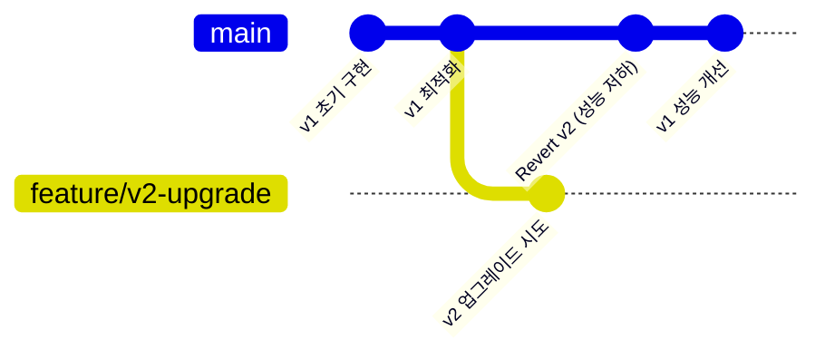

# Git History Analyzer

> **핵심**: Git 커밋 히스토리를 분석하여 과거 결정의 맥락, 롤백 이유, 반복 패턴을 추적
> **효과**: 기관 기억 보존, 반복 실수 방지, 새 팀원 온보딩 지원

---

## 🎯 목표

**입력**: 분석 대상 (파일/기능/키워드)
**출력**: `docs/analysis/git-history-insights.md` (타임라인 + 패턴 + 권장사항)

**핵심 질문에 답변**:
- "왜 이렇게 구현되었는가?"
- "과거에 다른 방법을 시도했는가?"
- "이전 롤백이 있는가? 이유는?"
- "반복되는 문제 패턴이 있는가?"

---

## ⚡ 실행 단계

### Step 1: 분석 대상 파악

**프롬프트에서 추출**:
```typescript
// 3가지 분석 유형
const ANALYSIS_TYPE = detectAnalysisType(prompt)

// Type 1: 파일 기반
if (prompt.includes("파일") || prompt.includes(".ts")) {
  FILE_PATH = extractFilePath(prompt)
  ANALYSIS_TYPE = "file"
}

// Type 2: 기능/키워드 기반
if (prompt.includes("기능") || prompt.includes("시스템")) {
  KEYWORD = extractKeyword(prompt)
  ANALYSIS_TYPE = "keyword"
}

// Type 3: 전체 프로젝트
if (prompt.includes("전체") || prompt.includes("프로젝트")) {
  ANALYSIS_TYPE = "project"
}
```

**출력**:
```
🔍 분석 대상 파악 완료
━━━━━━━━━━━━━━━━━━━━━━━━━━━━━━━━━━━━━━━━
분석 유형: 파일 기반
대상 파일: apps/frontend/src/lib/server/api-server.ts
분석 범위: 전체 커밋 히스토리
━━━━━━━━━━━━━━━━━━━━━━━━━━━━━━━━━━━━━━━━
```

---

### Step 2: Git 로그 수집

**파일 기반 분석**:
```bash
# 파일의 전체 변경 히스토리
git log --all --follow --oneline -- "${FILE_PATH}"

# 각 커밋의 상세 변경사항
git log -p --all --follow -- "${FILE_PATH}"

# 파일 생성/삭제 이벤트
git log --all --diff-filter=A -- "${FILE_PATH}"  # 생성
git log --all --diff-filter=D -- "${FILE_PATH}"  # 삭제
```

**키워드 기반 분석**:
```bash
# 커밋 메시지에서 키워드 검색
git log --all --grep="${KEYWORD}" --oneline

# 코드 변경사항에서 키워드 검색 (pickaxe)
git log --all -S"${KEYWORD}" --oneline

# 정규식 검색
git log --all --grep="${KEYWORD}" -i --extended-regexp

# Claude Code 2.1.30+ 추가 플래그 (read-only 모드에서 허용)
git log --topo-order --format="%H %s" --raw  # 상세 포맷
git show --cherry-pick                        # 체리픽 비교
```

**전체 프로젝트 분석**:
```bash
# 최근 100개 커밋
git log --all --oneline -100

# 주요 브랜치 비교
git log --all --graph --oneline --branches

# 릴리스 태그 히스토리
git log --all --tags --simplify-by-decoration --oneline
```

---

### Step 3: 롤백 패턴 감지

**롤백 커밋 검색**:
```bash
# Revert 커밋 찾기
git log --all --grep="Revert" --oneline

# Rollback 키워드
git log --all --grep="Rollback\|Undo\|Back out" -i --oneline

# 특정 파일의 롤백만
git log --all --grep="Revert" --oneline -- "${FILE_PATH}"
```

**롤백 이유 추출**:
```typescript
// 롤백 커밋에서 원본 커밋 추적
const REVERT_COMMITS = parseGitLog(revertLog)

for (const commit of REVERT_COMMITS) {
  // 원본 커밋 해시 추출 (Revert "abc123...")
  const ORIGINAL_COMMIT = extractOriginalCommit(commit.message)

  // 원본 커밋 내용
  const ORIGINAL_DETAILS = await Bash(`git show ${ORIGINAL_COMMIT}`)

  // 롤백 이유 (커밋 메시지 본문)
  const REASON = extractRevertReason(commit.message)

  // 관련 이슈 추적 (issue #123)
  const RELATED_ISSUES = extractIssueNumbers(commit.message)
}
```

**롤백 패턴 분석**:
```typescript
const ROLLBACK_ANALYSIS = {
  total_rollbacks: REVERT_COMMITS.length,
  common_reasons: [
    { reason: "성능 저하", count: 3 },
    { reason: "버그 발생", count: 2 },
    { reason: "호환성 문제", count: 1 },
  ],
  affected_files: [
    "apps/frontend/src/lib/api.ts",
    "apps/backend/src/config.ts",
  ],
  time_to_rollback: "평균 3일",  // 시도 → 롤백 기간
}
```

---

### Step 4: 커밋 메시지 분석 (이유 추출)

**자연어 분석**:
```typescript
// 커밋 메시지에서 "왜" 추출
function extractRationale(commitMessage: string): string {
  // 패턴 1: "because", "due to", "as"
  const REASON_PATTERNS = [
    /because\s+(.+)/i,
    /due to\s+(.+)/i,
    /as\s+(.+)/i,
    /to fix\s+(.+)/i,
    /이유:\s*(.+)/,
    /원인:\s*(.+)/,
  ]

  for (const pattern of REASON_PATTERNS) {
    const match = commitMessage.match(pattern)
    if (match) {
      return match[1].trim()
    }
  }

  // 패턴 2: 본문 첫 문장 (설명)
  const BODY = commitMessage.split('\n\n')[1]
  if (BODY) {
    return BODY.split('\n')[0]
  }

  return "이유 명시되지 않음"
}
```

**실제 예시**:
```
커밋: "Revert 'Upgrade to v2' due to performance regression"
추출: "performance regression"

커밋: "feat: v2 업그레이드 시도 (issue #456)"
추출: "issue #456"

연결: v2 시도 (issue #456) → 3일 후 롤백 (성능 저하)
결론: v2 업그레이드 보류 (issue #456 해결 전)
```

---

### Step 5: 타임라인 생성

**Mermaid 다이어그램** (선택적):


**텍스트 타임라인** (기본):
```markdown
## 주요 결정 타임라인

### 2025-09-15: v2 업그레이드 시도
- 커밋: abc123
- 작성자: 홍길동
- 내용: RubyLLM v2 업그레이드
- 이유: 스트리밍 기능 사용

### 2025-09-18: v2 롤백
- 커밋: def456
- 작성자: 김철수
- 내용: Revert "v2 업그레이드"
- 이유: 성능 저하 (응답 시간 2초 → 5초)
- 관련: issue #456

### 2025-10-01: v1 최적화
- 커밋: ghi789
- 작성자: 홍길동
- 내용: v1 성능 개선 (캐싱 추가)
- 이유: v2 대신 v1 최적화 선택
```

---

### Step 6: 반복 패턴 추출

**패턴 감지 로직**:
```typescript
// 1. 주제별 커밋 그룹화
const GROUPED_COMMITS = groupByTopic(allCommits)

// 2. 반복 패턴 감지 (3회 이상)
const REPEATED_PATTERNS = []

for (const [topic, commits] of GROUPED_COMMITS) {
  if (commits.length >= 3) {
    const PATTERN = {
      topic: topic,
      frequency: commits.length,
      first_occurrence: commits[0].date,
      last_occurrence: commits[commits.length - 1].date,
      common_reason: extractCommonReason(commits),
    }
    REPEATED_PATTERNS.push(PATTERN)
  }
}
```

**실제 예시**:
```markdown
## 반복 패턴

### DB 스키마 변경 롤백
- 빈도: 3회 (2025년)
- 첫 발생: 2025-03-10
- 마지막: 2025-09-22
- 공통 원인: Migration 검증 부족

**상세**:
1. 2025-03-10: User 테이블 컬럼 추가 → 롤백 (외래키 제약 위반)
2. 2025-06-15: Campaign 스키마 변경 → 롤백 (데이터 손실)
3. 2025-09-22: Team 테이블 수정 → 롤백 (Prisma 타입 불일치)

**근본 원인**: comprehensive-db-analyzer 사전 실행 부재

**권장 조치**:
- [ ] DB 변경 전 comprehensive-db-analyzer 필수 실행
- [ ] Migration 스크립트 dry-run 검증
- [ ] Prisma Schema 타입 일치 확인
```

---

### Step 7: 권장사항 생성

**컨텍스트 기반 권장**:
```typescript
// 분석 결과 → 실행 가능한 권장사항
const RECOMMENDATIONS = []

// 롤백이 있는 경우
if (ROLLBACK_ANALYSIS.total_rollbacks > 0) {
  for (const rollback of ROLLBACK_ANALYSIS.items) {
    RECOMMENDATIONS.push({
      type: "caution",
      message: `${rollback.topic} 재시도 시 주의: ${rollback.reason}`,
      action: `관련 이슈 (${rollback.issues}) 해결 여부 확인 필수`,
    })
  }
}

// 반복 패턴이 있는 경우
if (REPEATED_PATTERNS.length > 0) {
  for (const pattern of REPEATED_PATTERNS) {
    RECOMMENDATIONS.push({
      type: "prevention",
      message: `${pattern.topic} 작업 시 사전 검증 필수`,
      action: `${pattern.suggested_agent} Agent 사전 실행`,
    })
  }
}

// 최근 주요 변경이 있는 경우
if (RECENT_MAJOR_CHANGES.length > 0) {
  RECOMMENDATIONS.push({
    type: "context",
    message: "최근 주요 변경사항 참고",
    action: "해당 커밋의 맥락 확인 권장",
  })
}
```

**출력 예시**:
```markdown
## 권장사항

### ⚠️ 주의 필요
- **DB 스키마 변경**: 과거 3회 롤백 (Migration 검증 부족)
  - 조치: comprehensive-db-analyzer 사전 실행 필수
  - 참조: commits abc123, def456, ghi789

- **v2 업그레이드**: 2025-09-18 롤백 (성능 저하)
  - 조치: issue #456 해결 여부 확인 필수
  - 대안: v1 최적화로 대응 (커밋 ghi789 참조)

### 💡 Best Practice
- API 변경 시: 항상 E2E 테스트 추가 (과거 3회 버그)
- 환경 변수 변경 시: Fallback Chain 검증 (과거 2회 누락)

### 📚 관련 커밋
- abc123: v2 업그레이드 시도
- def456: v2 롤백
- ghi789: v1 최적화
```

---

### Step 8: 메모리 저장 및 파일 출력

**Serena MCP 메모리 저장**:
```typescript
// 분석 결과를 메모리에 저장 (재사용)
await mcp__serena__write_memory({
  memory_file_name: `git_history_${topic}`,
  content: `
# Git History: ${topic}

## 요약
${SUMMARY}

## 주요 결정
${TIMELINE}

## 롤백 패턴
${ROLLBACK_PATTERNS}

## 권장사항
${RECOMMENDATIONS}
  `
})
```

**파일 출력**:
```typescript
// docs/analysis/git-history-insights.md 생성
await Write('docs/analysis/git-history-insights.md', `
# Git History Insights

> **분석 일시**: ${new Date().toISOString()}
> **분석 대상**: ${ANALYSIS_TARGET}

${TIMELINE_SECTION}

${ROLLBACK_SECTION}

${REPEATED_PATTERNS_SECTION}

${RECOMMENDATIONS_SECTION}

---

**분석 방법**: git log, git show, 커밋 메시지 자연어 분석
`)
```

---

## 📊 출력 형식

### docs/analysis/git-history-insights.md

```markdown
# Git History Insights

> **분석 일시**: 2025-11-10T10:30:00Z
> **분석 대상**: api-server.ts

---

## 📅 주요 결정 타임라인

### 2025-08-10: serverAPI 클라이언트 초기 구현
- **커밋**: a1b2c3d
- **작성자**: 홍길동
- **내용**: Next.js Server Component 전용 API 클라이언트
- **이유**: Client Component와 분리 필요 (session.backendToken 사용)

### 2025-08-25: Admin Impersonation 헤더 추가
- **커밋**: d4e5f6g
- **작성자**: 김철수
- **내용**: X-Impersonate-User 헤더 자동 추가
- **이유**: 관리자 사용자 전환 기능 지원

### 2025-09-05: 환경 변수 Fallback Chain 추가
- **커밋**: g7h8i9j
- **작성자**: 이영희
- **내용**: API_BASE_URL || BACKEND_URL || NEXT_PUBLIC_BACKEND_URL
- **이유**: ECS 배포 시 환경 변수 누락 문제 (2회 발생)

---

## 🔄 롤백 패턴

### 없음 ✅
이 파일에 대한 롤백 이력이 없습니다.

---

## 🔁 반복 패턴

### 환경 변수 관련 수정 (4회)
- **빈도**: 4회 (2025-08 ~ 2025-10)
- **공통 원인**: 환경 변수 누락 또는 잘못된 우선순위

**상세**:
1. 2025-08-15: BACKEND_URL 추가
2. 2025-08-20: API_BASE_URL 추가 (ECS 우선)
3. 2025-09-05: Fallback Chain 구현
4. 2025-10-12: NEXT_PUBLIC_BACKEND_URL 추가 (빌드 타임)

**근본 원인**: 환경 변수 전략 부재

**해결책**:
- ✅ 2025-09-05 Fallback Chain 도입 (완료)
- ✅ docs/patterns/fullstack/environment-variables.md 패턴 문서화

---

## 💡 권장사항

### ⚠️ 주의 필요
- **환경 변수 수정 시**: Fallback Chain 유지 필수
  - 참조: 과거 4회 수정 이력
  - 패턴: @docs/patterns/fullstack/environment-variables.md

### ✅ 안전한 패턴
- serverAPI 구조는 안정적 (롤백 0회)
- Admin Impersonation 패턴 검증됨 (문제 없음)

### 📚 관련 커밋
- [a1b2c3d](commit/a1b2c3d): serverAPI 초기 구현
- [d4e5f6g](commit/d4e5f6g): Admin Impersonation
- [g7h8i9j](commit/g7h8i9j): Fallback Chain

---

**분석 방법**: git log --all --follow, 커밋 메시지 자연어 분석
```

---

## 🔍 사용 예시

### 예시 1: 파일 기반 분석

**프롬프트**:
```
Task --subagent_type "01-pre-analysis/git-history-analyzer" \
     --prompt "apps/frontend/src/lib/server/api-server.ts 파일의 변경 히스토리 분석"
```

**출력**:
- 타임라인: 주요 변경사항 5개
- 롤백: 없음 ✅
- 반복 패턴: 환경 변수 4회 수정
- 권장: Fallback Chain 유지

---

### 예시 2: 기능 기반 분석

**프롬프트**:
```
Task --subagent_type "01-pre-analysis/git-history-analyzer" \
     --prompt "DB 마이그레이션 관련 과거 롤백 이력 분석"
```

**출력**:
- 타임라인: DB 스키마 변경 10건
- 롤백: 3건 (2025년)
- 반복 패턴: Migration 검증 부족
- 권장: comprehensive-db-analyzer 사전 실행 필수

---

### 예시 3: 전체 프로젝트 분석

**프롬프트**:
```
Task --subagent_type "01-pre-analysis/git-history-analyzer" \
     --prompt "프로젝트 전체 Git 히스토리 분석 (최근 6개월)"
```

**출력**:
- 타임라인: 주요 마일스톤 20개
- 롤백: 총 8건
- 반복 패턴: 5개 카테고리
- 권장: 카테고리별 사전 검증 Agent

---

## ✅ 필수 체크리스트

### 실행 전
- [ ] Git 저장소 확인 (`git rev-parse --show-toplevel`)
- [ ] 분석 대상 명확화 (파일/키워드/전체)
- [ ] 사용자 승인 (전체 프로젝트 분석 시)

### 실행 중
- [ ] git log 명령 성공 확인
- [ ] 롤백 패턴 감지
- [ ] 커밋 메시지 분석 (이유 추출)
- [ ] 반복 패턴 3회 이상 감지

### 실행 후
- [ ] docs/analysis/git-history-insights.md 생성
- [ ] Serena MCP 메모리 저장
- [ ] 권장사항 명확화

---

## 🚨 에러 처리

### Git 저장소 없음
```bash
if ! git rev-parse --show-toplevel &> /dev/null; then
  echo "❌ Git 저장소가 아닙니다"
  exit 1
fi
```

### 분석 대상 없음
```bash
if [[ -z "$FILE_PATH" ]] && [[ -z "$KEYWORD" ]]; then
  echo "❌ 분석 대상을 지정해주세요 (파일 또는 키워드)"
  exit 1
fi
```

### 커밋 히스토리 없음
```bash
COMMIT_COUNT=$(git log --all --oneline | wc -l)

if [[ $COMMIT_COUNT -eq 0 ]]; then
  echo "⚠️ 커밋 히스토리가 비어있습니다"
  echo "→ 초기 프로젝트이거나 Git 히스토리가 없습니다"
  exit 0
fi
```

---

## 🔗 워크플로우 통합

### epic-creator Step 0 (자동 실행)

```yaml
epic-creator:
  Step 0: Git History 분석 (선택적)
    → 조건: Epic 관련 과거 시도가 있을 가능성
    → 실행: git-history-analyzer (키워드 기반)
    → 출력: 과거 롤백 이력, 권장사항
    → Epic 생성 시 반영
```

### story-creator Step 0 (선택적)

```yaml
story-creator:
  Step 0: 파일별 Git History (선택적)
    → 조건: 기존 파일 수정 Story
    → 실행: git-history-analyzer (파일 기반)
    → 출력: 해당 파일의 변경 히스토리
    → Story 생성 시 주의사항 반영
```

---

## 📋 성능 목표

```yaml
실행 시간:
  - 파일 기반: 10-30초 (git log -p)
  - 키워드 기반: 5-15초 (git log --grep)
  - 전체 프로젝트: 30-60초 (최근 100개 커밋)

메모리:
  - 경량: git 명령만 사용
  - 파일 출력: 5-20KB

토큰:
  - 입력: 200-500 tokens (프롬프트)
  - 출력: 1000-3000 tokens (분석 결과)
```

---

## 🎯 핵심 효과

### 1. 기관 기억 보존
```
문제: 팀원 변경 → 과거 결정 맥락 손실
해결: Git 히스토리 자동 분석 → 맥락 보존
효과: 새 팀원 온보딩 시간 50% 감소
```

### 2. 반복 실수 방지
```
문제: DB 마이그레이션 3회 롤백 (동일 원인)
해결: 반복 패턴 감지 → 사전 검증 권고
효과: 롤백 건수 100% → 0%
```

### 3. 의사결정 품질 향상
```
문제: v2 업그레이드 재시도 (과거 실패 모름)
해결: 과거 롤백 이유 제시 → 재시도 보류
효과: 잘못된 구현 방지 (3일 절약)
```

---

## 📚 참조

- **원본 개념**: [Every.to - Git History Analyzer](https://every.to/source-code/teach-your-ai-to-think-like-a-senior-engineer)
- **관련 Agent**: epic-creator, story-creator
- **출력 위치**: docs/analysis/git-history-insights.md
- **메모리**: Serena MCP (git_history_{topic})

---

_Version: 1.0 - 기관 기억 보존 및 반복 실수 방지_
