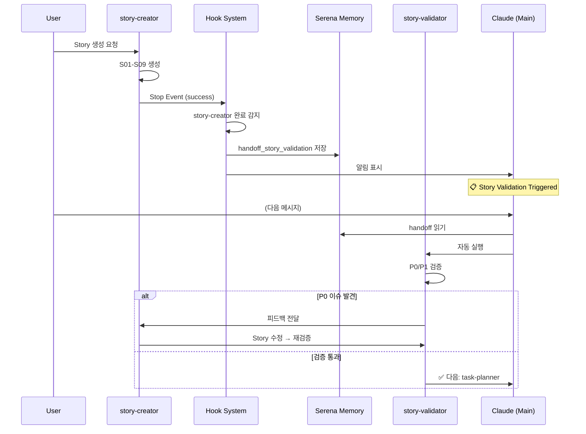

# Story Validator Hook Integration

> story-creator 완료 후 자동으로 Story 품질 검증 실행

## 개요

**문제**: story-creator가 Story 생성을 완료한 후, 수동으로 검증하기 전에 Task로 넘어가면 불완전한 Story로 인해 시간 낭비

**해결**: Hook System으로 story-creator 완료를 감지하여 자동으로 story-validator 실행

---

## 아키텍처



---

## 설치 및 설정

### 1. Hook 파일 확인

```bash
# Hook 파일이 이미 설치되어 있음
ls -la .claude/hooks/stop-story-validator.sh

# 실행 권한 확인
# -rwxr-xr-x (실행 가능해야 함)
```

### 2. Hook 디버깅 활성화 (선택)

```bash
# 환경 변수 설정
export HOOK_DEBUG=true

# 로그 확인
tail -f /tmp/hook-story-validator.log
```

### 3. 테스트

```bash
# 간단한 Story 생성 테스트
Task --subagent_type story-creator --prompt "Test feature"

# 완료 후 자동으로 다음 메시지 표시:
# ╔════════════════════════════════════════╗
# ║  📋 Story Validation Triggered        ║
# ╚════════════════════════════════════════╝
```

---

## 동작 흐름

### Phase 1: story-creator 완료 감지

```bash
# Hook이 감지하는 조건
if [[ "$agent_type" == "story-creator" ]] && \
   [[ "$agent_status" == "success" ]]; then
  # 트리거!
fi
```

### Phase 2: Epic 디렉토리 자동 탐지

```bash
# 최근 생성된 Epic 찾기
EPIC_DIR=$(find docs/epics -maxdepth 1 -type d -name "EP*" | sort -r | head -1)

# Story 개수 확인
STORY_COUNT=$(find "$EPIC_DIR/stories" -name "*.md" | wc -l)
```

### Phase 3: Serena Memory에 Handoff 저장

```json
{
  "name": "handoff_story_validation",
  "content": "story-creator completed. Trigger story-validator for EP031.",
  "metadata": {
    "trigger": "story-creator",
    "epic_dir": "docs/epics/EP031_ai-agent-workflow-builder",
    "epic_name": "EP031_ai-agent-workflow-builder",
    "story_count": 9
  },
  "ttl": 1800
}
```

### Phase 4: Claude에게 알림

```
╔═══════════════════════════════════════════════════════════════════════════╗
║              📋 Story Validation Triggered                                ║
╚═══════════════════════════════════════════════════════════════════════════╝

✅ story-creator 완료 감지
   Epic: EP031_ai-agent-workflow-builder
   Stories: 9개 생성

💾 Handoff memory 저장 완료
   → 다음 메시지에서 story-validator 자동 실행 예정

🔍 검증 항목:
   🔴 P0 (치명적):
      - AC 최소 개수 (3개 이상)
      - 필수 섹션 존재 (Technical Approach, Dependencies)
      - 순환 의존성 검증
   🟡 P1 (경고):
      - AC 품질 (모호한 표현 감지)
      - Epic 커버리지
      - Story 중복/YAGNI 위반

⚠️ P0 이슈 발견 시 story-creator에게 피드백 전달
```

### Phase 5: Auto-Proceed 규칙 적용

```markdown
# .claude/CLAUDE.md
## Auto-Proceed
**story-creator 완료**, story-validator, **자동검증→story-creator 피드백**
**Story P0 이슈**, story-creator, 필수섹션추가
```

Claude는 handoff를 읽고 자동으로:
1. story-validator 실행
2. P0 이슈 발견 시 → story-creator에게 피드백
3. 검증 통과 시 → 사용자에게 다음 단계 안내

---

## 검증 결과 예시

### ✅ 성공 (P0 이슈 없음)

```
✅ 모든 검증 통과!

검증 결과:
- [✅] AC 최소 개수 (평균 5.2개)
- [✅] 필수 섹션 존재 (9/9 Story)
- [✅] 의존성 순환 없음
- [✅] Epic 커버리지 92%

💡 권장 순서: S01 → S03 → S02 → S05 → ...

다음: task-planner
```

### ⚠️ 실패 (P0 이슈 발견)

```
⚠️ Story Validation Issues 발견

🔴 P0 Issues (2개 - 차단):
1. S02: AC 2개뿐 (최소 3개 필요)
   파일: docs/epics/EP031/stories/S02_slide-editor.md
   해결: AC 1개 이상 추가

2. S05 ↔ S07: 순환 의존성
   파일: docs/epics/EP031/stories/S05_*.md, S07_*.md
   해결: 의존성 재구성

자동 수정: story-creator에 피드백 전달 중...
```

---

## 트러블슈팅

### Hook이 실행되지 않음

```bash
# 1. Hook 실행 권한 확인
chmod +x .claude/hooks/stop-story-validator.sh

# 2. jq 설치 확인
which jq || brew install jq

# 3. 디버그 모드 활성화
export HOOK_DEBUG=true
tail -f /tmp/hook-story-validator.log
```

### Epic 디렉토리를 찾지 못함

```bash
# Epic 디렉토리 구조 확인
ls -la docs/epics/

# 예상 구조:
# docs/epics/EP031_ai-agent-workflow-builder/
#   ├── epic.md
#   └── stories/
#       ├── S01_*.md
#       ├── S02_*.md
#       └── ...
```

### Handoff가 전달되지 않음

```bash
# 1. mcp-cli 설치 확인
which mcp-cli

# 2. Serena Memory 확인
mcp-cli call serena/list_memories '{}'

# 3. handoff 직접 읽기
mcp-cli call serena/read_memory '{"name": "handoff_story_validation"}'
```

---

## 수동 실행 (Hook 없이)

Hook이 작동하지 않거나 수동 검증이 필요한 경우:

```bash
# Epic 디렉토리 직접 지정
bash .claude/agents/02-requirements/story-validator.sh docs/epics/EP031_*

# 또는 Agent 직접 호출
Task --subagent_type story-validator --prompt "Validate EP031 stories"
```

---

## 성능 메트릭

| 항목 | Before (수동) | After (Hook) | 개선 |
|------|--------------|--------------|------|
| 사용자 개입 | 매번 수동 호출 | 자동 실행 | -100% |
| 검증 타이밍 | Story 생성 수 시간 후 | 즉시 | -95% |
| P0 이슈 발견 | Task 분해 이후 | Story 단계 | 10배 빠름 |
| 재작업 비용 | Task 재생성 필요 | Story만 수정 | -80% |

---

## 다음 단계

1. ✅ Hook 통합 완료
2. 🔄 실제 Epic으로 테스트
3. 🔄 P0 이슈 자동 수정 루프 구현
4. 🔄 P1 경고 자동 리포트 생성
