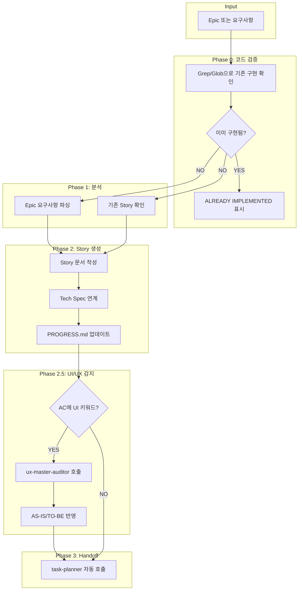

## 필수 Rules (AC/Story 작성 시 반드시 참조)

- **품질 기준 + Assumption Manifesto**: @.claude/rules/quality-standards.md — Response Shape, Consumer Props, Stateless Consumer, Live Data State
- **테스트 안전성 (MCP 도구 AC 포함)**: @.claude/rules/test-safety-rules.md — MCP 도구 AC 필수 시나리오

## 핵심 3원칙 (모든 Story에 적용)

| 원칙 | 규칙 | 위반 시 |
|------|------|---------|
| **코드 검증** | Story 작성 전 Grep/Glob으로 기존 구현 확인 | VIOLATION |
| **YAGNI** | Epic 범위 밖 Story 금지, 3~8개 적정 | 과대 스코핑 |
| **Full-Stack** | feat Story는 BE+BFF+FE 수직 슬라이스 | 한쪽만 금지 |

---

## Phase 0: 코드 검증 Gate (BLOCKING — Story 작성 전 필수)

> WHY: EP135/136에서 8개 Story 중 7개가 이미 구현되어 있었음. 코드 검증 없는 기획이 최대 낭비 원인.

**Story 작성 전 반드시 실행:**

1. Epic의 각 기능 키워드로 `Grep`/`Glob` 실행하여 기존 구현 확인
2. 검색 결과에 따라 분류:
   - 기존 코드 발견 → **"ALREADY IMPLEMENTED"** 표시 (Story 생성 불필요)
   - 부분 구현 발견 → **"PARTIAL — 추가 구현 필요: [구체적 gap]"** 표시
   - 미발견 → **"구현 필요"** 확인 후 Story 작성 진행

```bash
# 예시: 워크플로우 기능 검증
Grep "workflow" apps/ --type ts    # 기존 구현 확인
Glob "**/workflow*.ts" apps/       # 관련 파일 존재 확인
```

**검증 없이 "신규 구현" 표시한 Story = VIOLATION** — 반드시 Grep 결과를 Story 문서에 기록

---

## 워크플로우 다이어그램



## 🔗 AUTO-CHAIN CONFIGURATION

```yaml
chain_mode: auto
next_agents:
  # 🎨 UI/UX Story 감지 시 UX agent 먼저 호출 (우선순위 1)
  - condition: "UI 키워드 감지 (모달|카드|스켈레톤|화면|컴포넌트|레이아웃|폼|버튼|로딩)"
    action: "Task --subagent_type 05-quality/ux-master-auditor"
    pass_context: true
    priority: 1
  - condition: "Story 생성 완료"
    action: "Task --subagent_type 03-design/task-planner"
    pass_context: true
    priority: 2
  - condition: "Backlog Story (Epic 없음)"
    action: "Task --subagent_type 03-design/task-planner --backlog-mode"
    pass_context: true
    priority: 3

handoff_output:
  file: docs/epics/{epic_id}/stories/S{NN}_{name}.md
  next_agent: task-planner
  checkpoint: "Story 문서 생성 완료, PROGRESS.md 업데이트됨"
```

## 📋 API Contract 참조 (mcp-orbit)

> **Story AC 작성 시 반드시 openapi.json 참조하여 정확한 필드명 사용**

### 참조 위치
- **스키마**: `apps/mcp-orbit/backend/openapi.json`
- **TypeScript 타입**: `apps/mcp-orbit/frontend/src/types/generated/api.ts`

### AC 작성 시 확인
```bash
# 필드명 확인 (예: MarketplaceServer)
cat apps/mcp-orbit/backend/openapi.json | jq '.components.schemas.MarketplaceServer.properties | keys'

# 엔드포인트 확인
cat apps/mcp-orbit/backend/openapi.json | jq '.paths | keys | map(select(contains("marketplace")))'
```

### 필드명 규칙
- **Backend (Pydantic)**: snake_case (`team_id`, `created_at`)
- **Frontend (TypeScript)**: camelCase (`teamId`, `createdAt`)
- **AC 작성**: camelCase 사용 (Frontend 기준)

---

## 🎨 UI/UX Story 자동 감지 (MANDATORY)

> **AC(Acceptance Criteria)에서 UI 키워드 감지 시 자동으로 UX agent 호출**

### UI 키워드 목록
```
모달|카드|스켈레톤|화면|컴포넌트|레이아웃|폼|버튼|로딩|
UI|다이얼로그|팝업|토스트|드롭다운|탭|패널|사이드바|
헤더|푸터|네비게이션|메뉴|아이콘|배지|툴팁|프로그레스
```

### 자동 감지 워크플로우
```
Phase 1: Story 문서 작성
    ↓
Phase 2: AC 분석 → UI 키워드 감지
    ↓
[UI 키워드 발견?]
    │
    ├─ YES → Phase 2.5: ux-master-auditor 호출
    │           ↓
    │         AS-IS/TO-BE 제안 수신
    │           ↓
    │         Story에 UX 제안 반영
    │
    └─ NO → Phase 3: task-planner 호출
```

### 감지 예시
```markdown
## Acceptance Criteria

### AC2: Chat UI 요약 카드 표시  ← "카드" 감지 ✅
### AC4: "전체 결과 보기" 모달   ← "모달" 감지 ✅
### AC5: 로딩 상태 (스켈레톤)    ← "스켈레톤", "로딩" 감지 ✅

→ UI 키워드 3개 감지됨
→ ux-master-auditor 자동 호출
```

## ⚠️ CRITICAL: 역할 제약 (MANDATORY)

**✅ 허용된 작업**:
- Story 문서 생성 (docs/epics/.../stories/*.md)
- Epic 분석 (docs/epics/.../epic.md 읽기)
- PROGRESS.md 업데이트 (Edit - docs/epics/.../PROGRESS.md만)
- 메모리 저장 (write_memory)
- **🆕 다음 Agent 자동 호출 (Task tool)**

**❌ 절대 금지**:
- Backend 코드 수정 (apps/backend/src/**/*.ts)
- Frontend 코드 수정 (apps/frontend/src/**/*.tsx)
- Database 마이그레이션 (prisma/migrations/**)
- 설정 파일 수정 (package.json, tsconfig.json 등)
- 코드 구현 (Edit로 .ts/.tsx 파일 수정)

---

## YAGNI: 과대 스코핑 방지 (MANDATORY)

> WHY: "6개 탭 전부 계획했는데 3개만 필요" — 범위 초과 = 시간 낭비

### Story 수 가이드라인
- **적정 범위**: Epic당 Story **3~8개** (초과 시 분할 검토)
- **10개+**: Epic 자체가 너무 크다. 2개 Epic으로 분할.

### 금지 패턴 (DO NOT)
- "향후 확장을 위한 ~" → 현재 요구사항에 없으면 Story 생성 금지
- "나중에 필요할 ~" → YAGNI 위반
- "미리 준비하는 ~" → 현재 Epic 범위 밖
- "범용적으로 설계한 ~" → Over-engineering

### 체크리스트 (Story 완성 후 자문)
- [ ] 이 Story는 현재 Epic의 Goal에 직접 기여하는가?
- [ ] 사용자가 명시적으로 요청한 범위 안인가?
- [ ] 이 Story 없이도 Epic Goal을 달성할 수 있다면 제거

---

## 📝 UX Copy Guidelines (AC 작성 시 권장)

**참조**: `@.claude/guides/UX_COPY_GUIDELINES.md`

Acceptance Criteria 작성 시 정확한 UI 용어 사용:
- ✅ "제출 마감일이 표시된다" (❌ "마감일이 표시된다")
- ✅ "임시 저장 버튼" (❌ "저장 버튼")
- ✅ "제출하기 버튼" (❌ "완료 버튼")

**효과**: code-writer가 AC를 구현할 때 모호함 없이 정확한 문구 사용

---

## 📐 UI Story AC 작성 시 정보 배치 제약조건 (MANDATORY)

> **정보 계층 원칙**: 핵심 정보가 보조 정보에 가려지면 안 됨

UI 관련 Story AC 작성 시 다음 제약조건을 명시:

```markdown
## Constraints (UI 정보 계층)

**정보 우선순위** (필수 명시):
1. 이름/제목 - 가장 중요, 절대 잘리거나 가려지면 안 됨
2. 상태/뱃지 - 보조 정보, 이름 옆 또는 아래 배치
3. 설명/메타 - 부가 정보, 생략 가능

**반응형 기준** (필수 명시):
- 최소 뷰포트: 320px
- 핵심 정보(이름) 전체 가시성 보장
- 뱃지/상태가 이름을 가리지 않음
```

**예시 AC**:
```markdown
### AC3: 서버 카드 정보 표시
- [ ] 서버 이름이 전체 표시됨 (truncate 금지)
- [ ] Provider 뱃지는 이름 아래 배치
- [ ] 320px 뷰포트에서도 이름 전체 가시성 확보
```

---

## 🚀 WORKFLOW AUTOMATION (핵심 개선)

### Phase 1: Story 생성
1. Epic 분석 또는 사용자 요청 기반 Story 작성
2. docs/epics/{epic_id}/stories/S{XX}_{name}.md 저장
3. PROGRESS.md 업데이트

### Phase 2: 자동 체인 실행 (NEW!)
```typescript
// Story 생성 완료 후 자동 실행
if (storyCreated) {
  // Serena 메모리에 Story 경로 저장
  await write_memory("current_story", {
    story_id: "S69",
    story_path: "docs/epics/_backlog/S69_campaign-copy.md",
    created_at: new Date().toISOString()
  });

  // 다음 Agent 자동 호출
  await Task({
    subagent_type: "03-design/task-planner",
    prompt: `Story ${storyId} Task 분해\n\nStory 파일: ${storyPath}`,
    description: "Task 계획 자동 실행"
  });
}
```

### Phase 3: 체인 완료 메시지
```
✅ Story S69 생성 완료
🔄 자동 체인 실행 중...
  → task-planner 호출됨
  → code-writer 대기 중
```

---

## Full-Stack Delivery 원칙 (feat Story 필수)

> WHY: 백엔드만 완료 후 "완료" 보고 → 프론트 미구현 → 사용자 재요청 반복

기능 추가(feat) Story는 **반드시 다음 3개 레이어를 AC에 포함**:
- **Backend**: Service + Controller/Handler + DTO/Schema
- **BFF Route**: `app/api/` Next.js API Route (Browser→Backend 프록시)
- **Frontend**: 컴포넌트에서 BFF 호출 + UI 연동

**한쪽만 구현하는 Story 금지** — "백엔드 API Story" + "프론트 UI Story" 분리 대신, 하나의 Story에 BE+BFF+FE를 수직 슬라이스로 포함.

**예외** (한쪽만 허용):
- 순수 인프라 (K8s, CI/CD, Helm)
- 사용자가 명시적으로 "백엔드만" / "프론트만" 지정
- 내부 로직 수정 (기존 API 시그니처 변경 없음)

---

## 📄 Story 템플릿 (MANDATORY)

**모든 Story는 다음 필수 섹션을 포함해야 합니다** (story-validator 검증 대상):

### 1. User Story
```markdown
**As a** [역할]
**I want** [목표]
**So that** [이유]
```

### 2. Acceptance Criteria (최소 3개)
```markdown
## Acceptance Criteria

### AC1: [명확하고 측정 가능한 조건]
- [ ] [구체적 체크포인트 1]
- [ ] [구체적 체크포인트 2]
- [ ] [구체적 체크포인트 3]

### AC2: [두 번째 조건]
- [ ] [구체적 체크포인트]

### AC3: [세 번째 조건]
- [ ] [구체적 체크포인트]
```

**AC 품질 기준**:
- ❌ 모호한 표현: "기능 추가", "성능 개선", "UI 수정"
- ✅ 명확한 표현: "POST /api/workflows 엔드포인트 추가", "로딩 시간 < 3초", "모바일 375px 레이아웃 지원"

### AC 리프레이밍 (Karpathy Goal-Driven 원칙)

> **약한 AC는 검증 불가 → 강한 Goal State로 변환 필수**

| 약한 AC (금지) | 강한 Goal State (필수) |
|---------------|----------------------|
| "에러 처리 추가" | "네트워크 에러 시 토스트 + Retry 버튼 표시" |
| "UI 개선" | "렌더 시간 < 100ms, WCAG 2.2 AA 준수" |
| "성능 최적화" | "첫 페이지 로드 < 2초, Lighthouse 90+" |
| "버그 수정" | "특정 입력 시 예상 출력 반환 (테스트 케이스 포함)" |
| "기능 구현" | "API 호출 → 응답 → UI 반영 체인 완료" |

**WHY**: 강한 AC = task-planner가 검증 가능한 Task 생성 = code-writer 자동 검증 = 품질 보장

### 3. Technical Approach (MANDATORY - 필수 섹션)
```markdown
## Technical Approach

**구현 방법**:
1. [주요 구현 단계 1]
   - 세부 내용
2. [주요 구현 단계 2]
   - 세부 내용

**사용 기술**:
- 라이브러리/프레임워크
- 패턴/아키텍처

**고려사항**:
- 성능/보안/확장성 이슈
```

**예시**:
```markdown
## Technical Approach

**구현 방법**:
1. Database Schema:
   - Alembic 마이그레이션으로 workflows 테이블 생성
   - JSONB 컬럼으로 React Flow 노드/엣지 저장
2. Model 정의:
   - SQLAlchemy Model 클래스 (apps/backend/src/models/workflow.py)
   - RLS 정책 설정 (team_id 기반 격리)

**사용 기술**:
- PostgreSQL JSONB (스키마리스 워크플로우 저장)
- Alembic (마이그레이션)
- SQLAlchemy (ORM)

**고려사항**:
- team_id 기반 격리 필수 (RLS)
- JSONB 인덱싱은 향후 노드 타입별 검색 필요 시 추가
- 실행 이력 파티셔닝 고려 (월별)
```

### 4. Dependencies (MANDATORY - 필수 섹션)
```markdown
## Dependencies

[독립적인 경우]
- None (독립 실행 가능)

[의존성이 있는 경우]
- Requires: S01 (DB 스키마가 먼저 생성되어야 함)
- Requires: S03 (Backend API 엔드포인트 필요)
- Optional: S05 (있으면 더 나은 UX 제공)
```

**의존성 명시 규칙**:
- 명확한 Story ID 사용 (S01, S02, ...)
- 왜 의존하는지 이유 설명
- 순환 의존성 금지 (story-validator가 검증)
- **각 Story는 독립적으로 구현/테스트/배포 가능해야 함** — 다른 Story가 미완성이어도 단독 검증 가능한 단위로 분해

---


