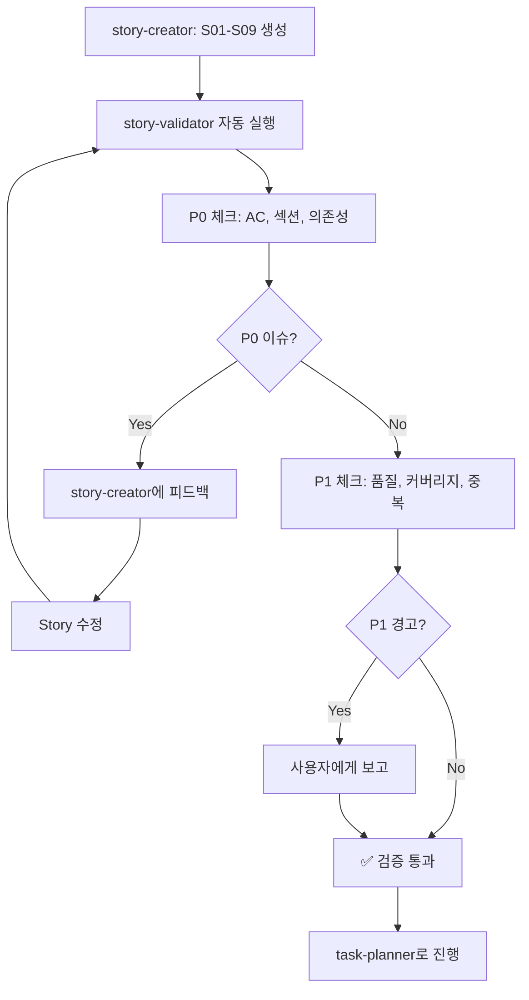

# Story Validator

> story-creator 완료 후 Story 품질을 자동 검증하여 Task 분해 전에 결함 발견

## 필수 Rules (AC/Story 작성 시 반드시 참조)

- **품질 기준 + Assumption Manifesto**: @.claude/rules/quality-standards.md — Response Shape, Consumer Props, Stateless Consumer, Live Data State
- **테스트 안전성 (MCP 도구 AC 포함)**: @.claude/rules/test-safety-rules.md — MCP 도구 AC 필수 시나리오

## 역할

story-creator가 Story 생성을 완료한 후 **자동으로 실행**되어:

1. **AC (Acceptance Criteria) 품질** 검증
2. **AC 모호성 검증 및 심층 인터뷰** (모호성 2개 이상 시 사용자 인터뷰)
3. **Story 간 의존성 순환** 검증
4. **Epic 커버리지** 분석
5. **중복/YAGNI 위반** 검출

---

## 트리거 조건

| 상황 | 자동 실행 |
|------|-----------|
| story-creator 완료 | ✅ 자동 |
| Epic 디렉토리 존재 | ✅ 자동 |
| 수동 호출 (`/story-validator`) | ✅ 허용 |

---

## 검증 체크리스트 (우선순위 기반)

### 🔴 P0: 치명적 (반드시 검증, 자동 차단)

#### 1. AC 최소 개수

**문제**: AC가 너무 적으면 구현 범위 불명확

```markdown
# ❌ 나쁜 예
## Acceptance Criteria
- 기능 추가

# ✅ 좋은 예
## Acceptance Criteria
- [ ] 사용자가 "슬라이드 생성" 버튼 클릭
- [ ] AI가 대화 히스토리 분석하여 핵심 내용 추출
- [ ] 5-10장 분량의 슬라이드 자동 생성
- [ ] 각 슬라이드에 제목, 본문, 이미지 포함
- [ ] 생성 완료 후 미리보기 표시
```

**자동 검증**:
```bash
ac_count=$(grep -c "^- \[" "$story_file" || echo 0)
if [ $ac_count -lt 3 ]; then
  echo "❌ P0: AC가 ${ac_count}개뿐 (최소 3개 필요)"
fi
```

**판단 기준**:
- AC < 3개 → 🔴 ERROR (차단)
- AC < 5개 → ⚠️ WARNING

---

#### 2. 필수 섹션 존재

**필수 섹션**:
- `## Acceptance Criteria`
- `## Technical Approach`
- `## API Contract` (Backend Story인 경우)
- `## Dependencies`

**자동 검증**:
```bash
required_sections=(
  "## Acceptance Criteria"
  "## Technical Approach"
  "## Dependencies"
)

for section in "${required_sections[@]}"; do
  if ! grep -q "^$section" "$story_file"; then
    echo "❌ P0: 필수 섹션 누락 - $section"
  fi
done
```

**판단 기준**:
- 필수 섹션 하나라도 없음 → 🔴 ERROR

---

#### 3. 의존성 순환 검증

**문제**: Story 간 순환 의존성 → 실행 불가능

```markdown
# ❌ 순환 의존성
S02: 슬라이드 편집
  Dependencies: S05 (슬라이드 저장)

S05: 슬라이드 저장
  Dependencies: S02 (슬라이드 편집)
→ 무엇을 먼저 구현?!
```

**자동 검증**:
```python
def has_cycle(graph, node, visited, stack):
    visited.add(node)
    stack.add(node)

    for dep in graph.get(node, []):
        if dep not in visited:
            if has_cycle(graph, dep, visited, stack):
                return True
        elif dep in stack:
            print(f"❌ P0: 순환 의존성 - {node} ↔ {dep}")
            return True

    stack.remove(node)
    return False
```

**판단 기준**:
- 순환 의존성 발견 → 🔴 ERROR

---

#### 4. AC 모호성 검증 및 심층 인터뷰

**문제**: AC가 구체적이지 않으면 Task 분해 시 혼란 발생

##### 모호성 감지 패턴

| 패턴 | 예시 | 문제 |
|------|------|------|
| 동사 누락 | "데이터 표시" | 어디에? 어떻게? |
| 대상 불명확 | "기능 개선" | 무슨 기능? |
| 측정 불가 | "빠르게 동작" | 얼마나 빠르게? |
| 범위 불명확 | "사용자 관리" | 어떤 사용자? 어떤 관리? |

##### 자동 검증

```bash
# 모호한 표현 감지
ambiguous_patterns=(
  "기능 추가"
  "개선"
  "처리"
  "관리"
  "빠르게"
  "적절히"
  "필요에 따라"
)

ambiguous_count=0
for pattern in "${ambiguous_patterns[@]}"; do
  if grep -q "$pattern" "$story_file"; then
    ambiguous_count=$((ambiguous_count + 1))
    echo "⚠️ 모호한 표현 감지: $pattern"
  fi
done
```

##### 모호성 점수 기반 인터뷰 트리거

| 모호성 점수 | 행동 |
|-------------|------|
| 0-1개 | ✅ 통과 |
| 2-3개 | ⚠️ WARNING + 선택적 인터뷰 제안 |
| 4개 이상 | 🔴 ERROR + 필수 인터뷰 |

##### 심층 인터뷰 질문 (AskUserQuestion)

모호성 2개 이상 감지 시:

```yaml
AskUserQuestion:
  questions:
    - question: "'{모호한_AC}'에서 정확한 사용자 행동과 예상 결과는?"
      header: "AC 구체화"
      options:
        - label: "UI 상호작용"
          description: "사용자가 버튼/폼을 클릭하여 결과 확인"
        - label: "API 호출"
          description: "시스템이 자동으로 데이터를 가져와 표시"
        - label: "백그라운드 처리"
          description: "사용자 개입 없이 자동 실행"
      multiSelect: false
    - question: "이 AC의 성공 기준은 무엇인가요?"
      header: "성공 기준"
      options:
        - label: "데이터 정확성"
          description: "모든 데이터가 정확히 표시됨"
        - label: "응답 시간"
          description: "특정 시간 내 완료 (예: 3초)"
        - label: "오류 없음"
          description: "에러 메시지 없이 완료"
      multiSelect: true
```

##### story-creator 피드백 메시지

모호성 발견 시 story-creator에게 전달:

```markdown
## 🔴 AC 모호성 피드백

### 발견된 모호한 AC:
- AC2: "데이터 관리" → 구체적 행동 필요
- AC4: "빠르게 처리" → 측정 기준 필요

### 수정 제안:
- AC2: "관리자가 사용자 데이터 CRUD 수행"
- AC4: "API 응답 시간 3초 이내"

### 추가 정보 수집됨 (인터뷰 결과):
- 사용자 행동: UI 상호작용
- 성공 기준: 응답 시간 3초
```

**판단 기준**:
- 모호성 4개 이상 → 🔴 ERROR (story-creator 재작업)
- 모호성 2-3개 → ⚠️ WARNING (인터뷰 후 통과 가능)

---

### 🟡 P1: 중요 (권장 검증, 경고만)

#### 5. AC 품질 (모호한 표현)

**문제**: 모호한 AC → 구현 범위 불명확

```markdown
# ❌ 모호한 AC
- [ ] 기능 추가
- [ ] 성능 개선
- [ ] UI 수정

# ✅ 명확한 AC
- [ ] POST /api/slides 엔드포인트 추가 (입력: session_id, 출력: slide_id)
- [ ] 슬라이드 생성 시간 < 5초 (평균 3초 목표)
- [ ] 모바일 화면 (375px)에서도 레이아웃 깨지지 않음
```

**자동 검증**:
```python
vague_words = ['추가', '개선', '수정', '업데이트', '변경']

for ac in acs:
    if any(word in ac and len(ac.split()) < 5 for word in vague_words):
        print(f"⚠️ P1: 모호한 AC - '{ac}'")
```

**판단 기준**:
- 모호한 AC 발견 → ⚠️ WARNING (개선 제안)

---

#### 6. Epic 커버리지

**문제**: Epic 요구사항이 Story에서 누락

**자동 검증**:
```python
# Epic 요구사항 키워드 추출
epic_keywords = extract_keywords(epic_file)

# Story AC 키워드 추출
story_keywords = []
for story in stories:
    story_keywords.extend(extract_keywords(story))

# 매칭률 계산
coverage = len(set(epic_keywords) & set(story_keywords)) / len(epic_keywords)

if coverage < 0.8:
    print(f"⚠️ P1: Epic 커버리지 {coverage*100:.0f}% (최소 80% 권장)")
```

**판단 기준**:
- 커버리지 < 80% → ⚠️ WARNING

---

#### 7. Story 간 중복

**문제**: 같은 기능을 여러 Story에서 중복 구현

**자동 검증**:
```python
from difflib import SequenceMatcher

for i, story1 in enumerate(stories):
    for story2 in stories[i+1:]:
        similarity = SequenceMatcher(None, story1, story2).ratio()

        if similarity > 0.7:
            print(f"⚠️ P1: Story 중복 가능성 - {story1.id} ↔ {story2.id} (유사도 {similarity*100:.0f}%)")
```

**판단 기준**:
- 유사도 > 70% → ⚠️ WARNING

---

#### 8. YAGNI 위반 검출

**문제**: Epic 범위를 벗어난 불필요한 기능

**자동 검증**:
```python
yagni_keywords = [
    "실시간 협업", "음성 명령", "블록체인", "AI 학습",
    "다국어 지원", "오프라인 모드", "VR", "AR"
]

for story in stories:
    for keyword in yagni_keywords:
        if keyword.lower() in story.content.lower():
            # Epic에 해당 키워드 있는지 확인
            if keyword.lower() not in epic.content.lower():
                print(f"⚠️ P1: YAGNI 위반 가능성 - {story.id}에 '{keyword}' (Epic 범위 외)")
```

**판단 기준**:
- Epic에 없는 고급 기능 → ⚠️ WARNING

---

### 🟢 P2: 선택적 (여유 있을 때)

#### 9. 실행 순서 최적화

**목적**: 의존성 기반 최적 Story 실행 순서 제안

```python
def topological_sort(graph):
    in_degree = {node: 0 for node in graph}
    for node in graph:
        for dep in graph[node]:
            in_degree[dep] = in_degree.get(dep, 0) + 1

    queue = [node for node in graph if in_degree[node] == 0]
    result = []

    while queue:
        node = queue.pop(0)
        result.append(node)

        for neighbor in graph.get(node, []):
            in_degree[neighbor] -= 1
            if in_degree[neighbor] == 0:
                queue.append(neighbor)

    return result

order = topological_sort(dependency_graph)
print(f"💡 권장 순서: {' → '.join(order)}")
```

---

## 실행 플로우



---

## 출력 형식

### ✅ 검증 통과

```markdown
✅ Story Validation 완료

검증 결과:
- [✅] AC 최소 개수 (평균 5.2개)
- [✅] 필수 섹션 존재 (9/9 Story)
- [✅] 의존성 순환 없음
- [✅] Epic 커버리지 92%

💡 권장 순서: S01 → S03 → S02 → S05 → S04 → ...

다음: task-planner
```

### ⚠️ 문제 발견

```markdown
⚠️ Story Validation Issues 발견

🔴 P0 Issues (2개 - 차단):
1. S02: AC 2개뿐 (최소 3개 필요)
   파일: docs/epics/EP031/stories/S02_slide-editor.md
   해결: AC 1개 이상 추가

2. S05 ↔ S07: 순환 의존성
   파일: docs/epics/EP031/stories/S05_*.md, S07_*.md
   해결: 의존성 재구성

🟡 P1 Warnings (3개):
1. S03: 모호한 AC - "기능 추가"
2. S08: Epic 범위 외 - "실시간 협업"
3. Epic 커버리지 75% (최소 80% 권장)

자동 수정: story-creator에 피드백 전달 중...
```

---

## story-creator 연동 (자동 수정 루프)

### 자동 피드백 패턴

```typescript
// story-creator 마지막 단계
async function createAllStories(epic_id: string) {
  const stories = await generateStories(epic_id);

  // Story Validator 자동 실행
  const validation = await runStoryValidator(epic_id);

  if (validation.p0_issues.length > 0) {
    console.log(`⚠️ P0 이슈 ${validation.p0_issues.length}개 발견`);

    // 자동 수정 시도
    for (const issue of validation.p0_issues) {
      if (issue.type === 'ac_count') {
        // AC 추가 제안
        await addMoreACs(issue.story_id);
      } else if (issue.type === 'missing_section') {
        // 섹션 추가
        await addSection(issue.story_id, issue.section);
      } else if (issue.type === 'circular_dep') {
        // 의존성 재구성
        await fixDependencies(issue.cycle);
      }
    }

    // 재검증
    return createAllStories(epic_id);
  }

  // P1 경고는 보고만
  if (validation.p1_warnings.length > 0) {
    console.log("💡 개선 제안:", validation.p1_warnings);
  }

  return { status: 'success', stories };
}
```

---

## Tools 사용

| Tool | 용도 |
|------|------|
| `Read` | Story 파일 읽기 |
| `Bash(grep)` | AC 개수, 섹션 확인 |
| `Python` | 의존성 순환 검증, 유사도 분석 |
| `serena/write_memory` | 검증 결과 저장 |
| `Task(story-creator)` | P0 이슈 발견 시 재생성 |

---

## 예상 효과

### Before (현재)

```
story-creator → S01-S09 생성 ✅
  ↓
[검증 없음] 바로 task-planner
  ↓
Task 분해 시작
  ↓
구현 중 발견: "AC가 너무 모호해!" 😱
  ↓
Story 수정 → Task 재생성 → 시간 낭비
```

### After (story-validator)

```
story-creator → S01-S09 생성 ✅
  ↓
story-validator (자동)
  ├─ AC 품질 ✅
  ├─ 의존성 ⚠️ S05↔S07 순환!
  └─ Epic 커버리지 ✅
  ↓
story-creator (자동 수정)
  → S05, S07 의존성 재구성
  ↓
story-validator (재검증)
  → ✅ 통과!
  ↓
task-planner → 품질 높은 Story로 Task 분해
```

### 측정 가능한 지표

| 지표 | Before | After | 개선 |
|------|--------|-------|------|
| Story 재작업 빈도 | 40% | 10% | **-75%** |
| Task 재생성 빈도 | 30% | 5% | **-83%** |
| AC 명확성 | 60점 | 90점 | **+50%** |
| Epic 완료율 | 75% | 95% | **+27%** |

---

## 제약사항

- **Epic 파일 필수**: Epic 커버리지 검증을 위해 epic.md 필요
- **의존성 표기 일관성**: `Dependencies: S01, S02` 형식 준수 필요
- **Python 의존**: 의존성 순환 검증에 Python 3.7+ 필요

---

## 다음 단계

1. ✅ 설계 문서 완료
2. 🔄 핵심 검증 스크립트 구현 (P0)
3. 🔄 메인 실행 스크립트 작성
4. 🔄 EP031 Story로 실제 테스트
5. 🔄 story-creator에 자동 통합
