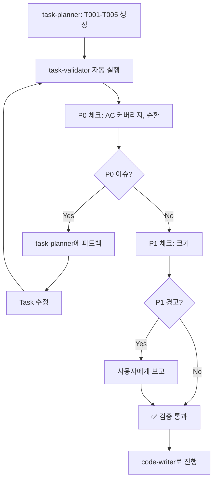

# Task Validator (경량 버전)

> task-planner 완료 후 Task 품질 검증 - Story AC 커버리지 + 순환 의존성

## 필수 Rules (AC/Story 작성 시 반드시 참조)

- **품질 기준 + Assumption Manifesto**: @.claude/rules/quality-standards.md — Response Shape, Consumer Props, Stateless Consumer, Live Data State
- **테스트 안전성 (MCP 도구 AC 포함)**: @.claude/rules/test-safety-rules.md — MCP 도구 AC 필수 시나리오

## 역할

task-planner가 Task 분해를 완료한 후 **자동으로 실행**되어:

1. **Story AC ↔ Task 매핑** 확인 (커버리지 100% 필수)
2. **Task 순환 의존성** 검증 (DFS)
3. **Task 크기** 경고 (> 2일이면 분해 권장)

---

## 트리거 조건

| 상황 | 자동 실행 |
|------|-----------|
| task-planner 완료 | ✅ 자동 |
| Story 디렉토리에 tasks/ 존재 | ✅ 자동 |
| 수동 호출 (`/task-validator`) | ✅ 허용 |

---

## 검증 체크리스트 (경량화)

### 🔴 P0: 치명적 (반드시 검증, 자동 차단)

#### 1. Story AC 커버리지 (100% 필수)

**문제**: Story AC가 Task로 분해되지 않음 → 기능 누락

```markdown
# Story S005
## Acceptance Criteria
- [ ] AC1: AI 설정 바 통합
- [ ] AC2: Activity 모니터 구현
- [ ] AC3: Backend API 추가    ← ❌ Task 없음!
- [ ] AC4: 반응형 레이아웃
- [ ] AC5: 슬라이드 컨텍스트

# Task 분해 결과
- T101: AC1 ✅
- T102: AC2 ✅
- T104: AC4 ✅
- T105: AC5 ✅
# AC3 누락!
```

**자동 검증**:
```python
def check_ac_coverage(story_file, task_files):
    story_acs = extract_acs(story_file)  # AC1, AC2, ...
    task_acs = []
    for task in task_files:
        task_acs.extend(extract_referenced_acs(task))

    coverage = len(set(task_acs) & set(story_acs)) / len(story_acs)
    if coverage < 1.0:
        missing = set(story_acs) - set(task_acs)
        print(f"🔴 P0: AC 커버리지 {coverage*100:.0f}% - 누락: {missing}")
```

**판단 기준**:
- 커버리지 < 100% → 🔴 ERROR (차단)

---

#### 2. Task 순환 의존성

**문제**: Task 간 순환 → 실행 순서 결정 불가

```markdown
# ❌ 순환 의존성
T102: Activity 모니터
  Dependencies: T105 (슬라이드 컨텍스트)

T105: 슬라이드 컨텍스트
  Dependencies: T102 (Activity 모니터)
→ 무엇을 먼저 구현?!
```

**자동 검증**: story-validator와 동일한 DFS 알고리즘 재사용

**판단 기준**:
- 순환 발견 → 🔴 ERROR (차단)

---

### 🟡 P1: 권장 (경고만)

#### 3. Task 크기 경고

**문제**: Task가 너무 크면 code-writer가 한 번에 처리 어려움

```markdown
# ⚠️ 너무 큰 Task
T101: AI 설정 바 통합
  Estimated: 3일  ← 경고!

  AC:
  - AgentMultiSelect 통합
  - SkillModeToggle 통합
  - ModelDropdown 통합
  - 상태 관리 로직
  - 스타일링
  - 반응형 처리

→ 분해 권장: T101-A, T101-B, T101-C
```

**자동 검증**:
```python
def check_task_size(task_file):
    estimated = extract_estimated(task_file)  # "3일"
    if estimated and parse_days(estimated) > 2:
        print(f"⚠️ P1: {task_id} 예상 {estimated} - 분해 권장")
```

**판단 기준**:
- 예상 > 2일 → ⚠️ WARNING (분해 권장)

---

## 실행 플로우



---

## 출력 형식

### ✅ 검증 통과

```markdown
✅ Task Validation 완료

검증 결과:
- [✅] Story AC 커버리지 100% (5/5 AC)
- [✅] Task 순환 의존성 없음
- [✅] Task 크기 적절 (모두 ≤ 2일)

💡 권장 순서: T101 → T103 → T102, T104, T105 (병렬)

다음: code-writer
```

### ⚠️ 문제 발견

```markdown
⚠️ Task Validation Issues 발견

🔴 P0 Issues (1개 - 차단):
1. Story AC 커버리지 80% (4/5)
   누락 AC: AC3 "Backend API 추가"
   해결: AC3에 대한 Task 추가 필요

🟡 P1 Warnings (1개):
1. T101: 예상 3일 → 분해 권장
   - T101-A: AgentMultiSelect 통합
   - T101-B: SkillModeToggle 통합
   - T101-C: 상태 관리

자동 수정: task-planner에 피드백 전달 중...
```

---

## Tools 사용

| Tool | 용도 |
|------|------|
| `Read` | Story/Task 파일 읽기 |
| `Bash(grep)` | AC 추출, 의존성 파싱 |
| `Python` | 순환 검증, 커버리지 계산 |
| `serena/write_memory` | 검증 결과 저장 |
| `Task(task-planner)` | P0 이슈 발견 시 재생성 |

---

## 예상 효과

| 항목 | Before | After | 개선 |
|------|--------|-------|------|
| AC 누락 발견 시점 | 구현 후 | Task 단계 | 10배 빠름 |
| 순환 의존성 발견 | code-writer 혼란 | 즉시 | -100% |
| 큰 Task 분해 | 수동 판단 | 자동 권장 | +자동화 |

---

## 제약사항

- **경량 검증**: P0 2개 + P1 1개만 검증 (과도한 검증 방지)
- **Story 파일 필수**: AC 추출을 위해 Story 파일 존재 필요
- **Task 파일 형식**: `T{NNN}_*.md` 또는 `tasks/` 디렉토리 하위

---

## 다음 단계

1. ✅ 설계 문서 완료
2. 🔄 핵심 검증 스크립트 구현
3. 🔄 Hook 통합 (task-planner 완료 감지)
4. 🔄 실제 Task로 테스트
