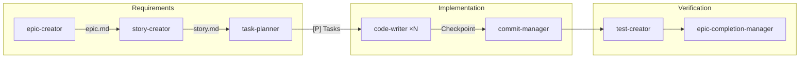

# Agent 체인 중단 방지 규칙

> **핵심**: Agent 체인 실행 중 **절대 직접 구현 금지**
> **원칙**: 모든 Task는 code-writer Agent 호출 필수

---

## 🔄 Agent 체인 전체 흐름



---

## 📋 [P] 병렬 실행 규칙

### Task 병렬 표시 형식

```markdown
## Phase 2: Foundation ⚠️ BLOCKING

- [ ] T001 [P] Model 생성 (users.py)
- [ ] T002 [P] Service 생성 (auth.py)
- [ ] T003 [P] Repository 생성 (user_repo.py)
- [ ] T004 Integration (depends: T001-T003)

**Checkpoint**: Foundation 완료 → Story Tasks 병렬 진행 가능
```

### [P] 표시 의미

| 표시 | 의미 | 실행 방식 |
|------|------|----------|
| `[P]` | Parallelizable | 다른 [P] Task와 동시 실행 가능 |
| (없음) | Sequential | 선행 Task 완료 후 실행 |
| `depends:` | Dependency | 명시된 Task 완료 필수 |

### 병렬 실행 조건

```yaml
병렬 가능:
  - 다른 파일 수정 (충돌 없음)
  - 같은 Phase 내 [P] 표시
  - 의존성 없음

순차 필수:
  - 같은 파일 수정
  - depends 명시
  - Phase 간 이동 (GATE 통과 필요)
```

---

## ✅ Checkpoint 규칙

### Checkpoint 정의

```markdown
**Checkpoint**: [달성 조건] → [다음 단계 허용]

예시:
- **Checkpoint**: Foundation 완료 → 모든 Story 병렬 진행 가능
- **Checkpoint**: US1 구현 완료 → US1 독립 테스트 가능
- **Checkpoint**: 모든 Task 완료 → commit-manager 실행
```

### Phase별 Checkpoint

```yaml
Phase 1 (Setup):
  checkpoint: "프로젝트 구조 준비 완료"
  gate: "기본 의존성 설치됨"

Phase 2 (Foundation):
  checkpoint: "핵심 인프라 구축 완료"
  gate: "⚠️ BLOCKING - 모든 Story가 이 Phase 대기"

Phase 3+ (Stories):
  checkpoint: "User Story N 독립 테스트 가능"
  gate: "해당 Story의 모든 Task 완료"

Phase N (Polish):
  checkpoint: "통합 테스트 통과"
  gate: "모든 Story Checkpoint 통과"
```

---

## 🚦 Validation Gate 규칙

### Gate 정의

각 Phase 전후에 **필수 검증 포인트**를 설정하여 품질 보장:

```yaml
Phase 0 Gate (계획 → 조사):
  검증: Constitution Check 완료
  조건: 5대 원칙 체크박스 모두 ✓
  실패 시: 계획 수정 후 재시도
  참조: @.claude/guides/CONSTITUTION.md

Phase 1 Gate (조사 → 설계):
  검증: 기술 조사 완료
  조건:
    - research.md 작성됨
    - "NEEDS CLARIFICATION" 항목 0개
  실패 시: 추가 조사 필요

Phase 2 Gate (설계 → 구현):
  검증: 설계 문서 완성
  조건:
    - data-model.md 작성됨
    - API contracts 정의됨
    - Constitution 재확인 완료
  실패 시: 설계 보완 필요

Story Gate (Story 완료):
  검증: 독립 테스트 가능
  조건:
    - Checkpoint 달성
    - 모든 Task 완료
    - 독립 테스트 통과
  실패 시: 미완료 Task 처리
```

### Gate 검증 템플릿

```markdown
## Gate Check: Phase {N} → Phase {N+1}

**Gate 조건**:
- [ ] {조건 1}
- [ ] {조건 2}
- [ ] {조건 3}

**결과**: {PASS | FAIL}

**FAIL 시 조치**:
- [ ] {필요한 작업}
```

### 자동 Gate 검증 (Hook 연동)

```yaml
Phase 0 Gate:
  hook: pre-tool-use-first-response-guard.sh
  검증: STOP → ANALYZE → ROUTE 템플릿 사용

Phase 2 Gate:
  hook: pattern-compliance-checker.sh
  검증: Constitution 원칙 준수

Story Gate:
  hook: post-tool-use-task-sync.sh
  검증: PROGRESS.md 업데이트 및 Checkpoint 확인
```

---

## 🔍 근본 원인 (Root Cause)

### 문제 패턴

```
✅ code-writer(T001) 완료
✅ code-writer(T002) 완료
→ "✅ 완료! 이제 T003을 구현하겠습니다" 선언
→ ❌ Agent 호출 없이 직접 Write/Edit 시작 (CRITICAL BUG)
```

### 왜 발생하는가?

1. **명시적 Agent 호출 체크 부재**
   - "구현하겠습니다" 선언 후 자동 Task tool 호출 누락

2. **Agent 체인 상태 관리 부재**
   - T001, T002는 Agent 호출 → T003부터 갑자기 직접 구현

3. **완전 자동 실행 모드 중단**
   - 자동 실행 중 갑자기 수동 모드로 전환

---

## ⛔ CRITICAL VIOLATION

### 절대 금지 (ABSOLUTE PROHIBITION)

```yaml
Task 완료 후:
  ❌ "구현하겠습니다" 선언 → 직접 Write/Edit 시작
  ❌ "작성하겠습니다" 선언 → 직접 구현
  ❌ 다음 Task 존재 → Agent 호출 없이 직접 작업
  ❌ Agent가 파일 생성 누락 → 직접 파일 생성 (NEW!)

✅ 올바른 방법:
  Task 완료 후 → 다음 Task 존재 → code-writer Agent 호출 (MANDATORY)
  Agent 파일 누락 → 같은 Agent 재실행 (MANDATORY)
```

### 🆕 Agent 작업 미완료 규칙

```yaml
Agent 실행 후 체크:
  1. 예상 산출물 확인 (Story 파일, Task 파일, 코드 등)
  2. 산출물 누락 시:
     ❌ 직접 생성 절대 금지
     ✅ 같은 Agent 재실행 필수

예시:
  story-creator 완료 → Story 파일 없음
  ❌ Write("S69_story.md", content)  # VIOLATION!
  ✅ Task --subagent story-creator --prompt "Story 파일 생성"
```

---

## 🚨 강제 규칙 (Hard Rules)

### 규칙 1: "구현하겠습니다" 선언 = Agent 호출 필수

```yaml
트리거 키워드:
  - "구현하겠습니다"
  - "작성하겠습니다"
  - "추가하겠습니다"

필수 조치:
  1. STOP (즉시 중단)
  2. CHECK: Task tool로 code-writer 호출했는가?
  3. NO → CRITICAL VIOLATION
```

**올바른 패턴**:
```typescript
// ✅ 선언과 동시에 Task tool 호출
console.log("T003을 구현하겠습니다")
await Task({
  subagent_type: "04-implementation/code-writer",
  prompt: "T003 구현",
  description: "T003: Admin Page 통합"
})
```

**잘못된 패턴**:
```typescript
// ❌ 선언만 하고 직접 구현
console.log("T003을 구현하겠습니다")
Write("file.tsx", content)  // VIOLATION!
```

---

### 규칙 2: Write/Edit 직접 사용 전 Agent 존재 확인

```yaml
Write/Edit 사용 전 체크:
  1. code-writer Agent 존재하는가?
  2. YES (존재함) → Agent 호출 필수 (직접 사용 금지)
  3. NO (없음) → 직접 사용 가능
```

**예시**:
```typescript
// Agent 존재 확인
const hasCodeWriter = existsAgent("04-implementation/code-writer")

if (hasCodeWriter) {
  // ✅ Agent 호출
  await Task({ subagent_type: "code-writer", ... })
} else {
  // ✅ 직접 사용 (Agent 없는 경우만)
  Write("file.tsx", content)
}
```

---

### 규칙 3: Agent 체인 중단 금지

```yaml
완전 자동 실행 모드:
  시작: "[완전 자동 실행 시작]" 선언
  진행: T001 → T002 → T003 (모두 code-writer 호출)
  종료: "[완전 자동 실행 완료]" 선언

중단 금지:
  ❌ T001 (Agent) → T002 (Agent) → T003 (직접 구현)
  ✅ T001 (Agent) → T002 (Agent) → T003 (Agent)
```

**모드 일관성 유지**:
- 자동 실행 모드 시작 → 종료까지 모든 Task는 Agent
- 중간에 수동 모드 전환 절대 금지

---

## 🚨 Task Tool 호출 강제 규칙

> **핵심**: "자동 실행" 선언 시 **즉시 Task tool 호출 필수**. Read/Search 먼저 금지.

### ROUTE 단계에서 필수 순서

**✅ 올바른 순서 (선언과 실행 동시)**:
```yaml
Step 1: [선언] "task-planner 자동 실행"
Step 2: Task(task-planner, ...) 즉시 호출 (같은 메시지)
Step 3: Agent 완료 대기
```

**❌ 금지된 순서 (선언-실행 Gap)**:
```yaml
Step 1: [선언] "task-planner 자동 실행"
Step 2: Read(...) // ❌ VIOLATION - Agent 호출 전 Read 금지
Step 3: Search(...) // ❌ VIOLATION - Agent 호출 전 Search 금지
Step 4: "참조 코드 분석 후 Agent 호출" // ❌ VIOLATION
```

### 왜 중요한가?

1. **Coverage Gap**: Read/Search는 이제 훅으로 감시됨
2. **Execution Gap**: "선언만 하고 실행 안 함" 패턴 방지
3. **Agent Chain 보호**: 모든 분석/구현은 Agent가 수행해야 함

### 실패 사례 (2025-11-13)

```yaml
선언: "task-planner 자동 실행"
실행: Read(LeaderSparkNoteDashboard.tsx) ❌
     Search("**/*.tsx") ❌
     Read(SparkNotePageClient.tsx) ❌

결과: Agent Chain Interruption (훅 미작동, 3-Layer Gap)
```

### 올바른 사례

```yaml
선언: "task-planner 자동 실행"
실행: Task(task-planner, prompt: "...") ✅
     → task-planner가 내부적으로 Read/Search 수행
     → 분석 완료 후 결과 반환
```

---

## 📋 Pre-Action 체크리스트

**작업 시작 전 항상 확인**:

```yaml
1. ⛔ "구현하겠습니다" 선언 후
   → Task tool 호출했는가?
   → NO → VIOLATION

2. ⛔ Write/Edit 직접 사용 전
   → code-writer Agent 존재 확인했는가?
   → YES (존재함) → Agent 호출 필수

3. ⛔ Agent 체인 중간
   → 다음 Task도 Agent 호출하는가?
   → NO → 체인 중단 (VIOLATION)

4. ⛔ 완전 자동 실행 모드
   → 모든 Task가 Agent로 실행되는가?
   → NO → 모드 중단 (VIOLATION)
```

---

## 🔧 상태 관리 (State Management)

### Agent 체인 상태 추적 (병렬 고려)

```yaml
현재 상태:
  - T001-S03: code-writer 완료 ✅
  - T002-S03: code-writer 완료 ✅
  - [T003, T004, T005]: 병렬 실행 가능 ⏳

의존성 분석:
  T003: 독립적 (T001, T002와 무관)
  T004: 독립적 (T001, T002와 무관)
  T005: 독립적 (T001, T002와 무관)
  T006: T003, T004, T005 의존

다음 액션:
  ✅ 단일 메시지로 [T003, T004, T005] 병렬 Task 호출
  ❌ T003 → T004 → T005 순차 실행 (VIOLATION)
  ❌ Write/Edit 직접 사용 (VIOLATION)

예상 시간: 5분 (병렬) vs 15분 (순차)
```

### 병렬 실행 패턴

**단일 메시지로 여러 Task 호출**:
```typescript
// ✅ 올바른 병렬 실행
[
  Task({ subagent_type: "code-writer", prompt: "T003", description: "T003" }),
  Task({ subagent_type: "code-writer", prompt: "T004", description: "T004" }),
  Task({ subagent_type: "code-writer", prompt: "T005", description: "T005" })
]
```

**참조**: @.claude/guides/PARALLEL_EXECUTION_GUIDE.md

---

## 💡 실전 예시

### ❌ 잘못된 실행 (VIOLATION)

```
⏺ code-writer(T001-S03) → Done ✅
⏺ code-writer(T002-S03) → Done ✅

"✅ T001, T002 완료! 이제 T003 Admin Page 통합을 구현하겠습니다."

⏺ Write(EvaluatorModal.tsx) ❌ VIOLATION
⏺ Write(useEvaluator.ts) ❌ VIOLATION
⏺ Edit(OrganizationInfoClient.tsx) ❌ VIOLATION
```

**문제점**:
- code-writer Agent 호출 없이 직접 구현 시작
- Agent 워크플로우 중단
- 자동 검증/상태 업데이트 누락

---

### ✅ 올바른 실행

```
⏺ code-writer(T001-S03) → Done ✅
⏺ code-writer(T002-S03) → Done ✅

"✅ T001, T002 완료! 이제 T003을 code-writer Agent로 구현합니다."

⏺ Task(code-writer, T003-S03) ✅
  ⎿ Done
  ⏺ Write(EvaluatorModal.tsx)
  ⏺ Write(useEvaluator.ts)
  ⏺ Edit(OrganizationInfoClient.tsx)
```

**올바름**:
- T003도 code-writer Agent 호출
- Agent 워크플로우 유지
- 자동 검증/상태 업데이트 수행

---

### ✅ 올바른 병렬 실행

```
⏺ code-writer(T001-S03) → Done ✅
⏺ code-writer(T002-S03) → Done ✅

"✅ T001, T002 완료! T003-T005는 독립적이므로 병렬 실행합니다."

⏺ [병렬 실행] ✅
  ├─ Task(code-writer, T003-S03)
  ├─ Task(code-writer, T004-S03)
  └─ Task(code-writer, T005-S03)

예상 시간: 5분 (순차 15분 대비 3배 빠름)
```

**올바름**:
- 의존성 분석 수행
- 단일 메시지로 병렬 호출
- 예상 시간 비교 제시

---

## 💥 위반 시 에러 메시지

```
❌ AGENT CHAIN INTERRUPTION DETECTED

Violation: Direct implementation without Agent call
Context: Task T003-S03 (Admin Page 통합)
Expected: Task(code-writer, "T003-S03") 호출
Actual: Write("EvaluatorModal.tsx") 직접 호출

Impact:
  - Agent 워크플로우 중단
  - 자동 검증/상태 업데이트 누락
  - CLAUDE.md 규칙 위반

Required Action:
  1. 현재 작업 중단
  2. Task tool로 code-writer Agent 호출
  3. Agent가 구현 완료할 때까지 대기
```

---

## 🛡️ 필수 체크포인트

### 모든 Task 완료 시 강제 체크

**✅ 올바른 패턴**:
```typescript
async function completeTask(taskId: string) {
  console.log(`✅ ${taskId} 완료!`)

  const nextTask = getNextTask()
  if (nextTask) {
    // ✅ MANDATORY: 다음 Task도 code-writer 호출
    await Task({
      subagent_type: "04-implementation/code-writer",
      prompt: `${nextTask.id}: ${nextTask.description} 구현`,
      description: nextTask.description
    })
  } else {
    console.log("✅ 모든 Task 완료! Story 완료 보고")
  }
}
```

**❌ 잘못된 패턴 (VIOLATION)**:
```typescript
async function completeTask(taskId: string) {
  console.log(`✅ ${taskId} 완료! 이제 다음 작업을 구현하겠습니다.`)

  // ❌ Agent 호출 없이 직접 작업
  Write("file.tsx", content)  // VIOLATION!
  Edit("another.ts", ...)     // VIOLATION!
}
```

---

## 🔧 상태 관리 예시

### 병렬 실행 상태 추적

```yaml
체인 상태:
  - T001-S03: code-writer 완료 ✅
  - T002-S03: code-writer 완료 ✅
  - [T003, T004, T005]: 병렬 실행 가능 ⏳

의존성 분석:
  T003: 독립적 (T001, T002와 무관) ✅
  T004: 독립적 (T001, T002와 무관) ✅
  T005: 독립적 (T001, T002와 무관) ✅
  T006: T003, T004, T005 의존 ❌

다음 액션:
  ✅ 단일 메시지로 [T003, T004, T005] 병렬 호출
  ❌ 순차 실행 (T003 → T004 → T005)
  ❌ Write/Edit 직접 사용

효율 비교:
  - 병렬: 5분
  - 순차: 15분
  - 개선: 3배 빠름
```

---

## 🎯 Anti-patterns (금지)

### Anti-pattern 1: 선언-실행 Gap

```
❌ 잘못된 예:
  "task-planner 자동 실행합니다"
  Read(...)  // Gap!
  Search(...)  // Gap!
  Task(task-planner)  // 너무 늦음

✅ 올바른 예:
  "task-planner 자동 실행합니다"
  Task(task-planner)  // 즉시 호출
```

### Anti-pattern 2: 체인 중단

```
❌ 잘못된 예:
  code-writer(T001) ✅
  code-writer(T002) ✅
  Write(T003)  // 체인 중단!

✅ 올바른 예:
  code-writer(T001) ✅
  code-writer(T002) ✅
  code-writer(T003) ✅  // 체인 유지
```

### Anti-pattern 3: 병렬 가능한데 순차

```
❌ 잘못된 예:
  의존성 없음 확인 ✅
  Task(T001) → 대기 → Task(T002) → 대기 → Task(T003)
  예상: 15분

✅ 올바른 예:
  의존성 없음 확인 ✅
  [Task(T001), Task(T002), Task(T003)]  // 단일 메시지
  예상: 5분 (3배 빠름)
```

---

## ✅ 체크리스트 Template

**매 Task 완료 시 실행**:

```markdown
## Task ${TASK_ID} 완료 후 체크

- [ ] 다음 Task 존재 확인
- [ ] 다음 Task 있음 → Task tool 호출 (code-writer)
- [ ] "구현하겠습니다" 선언 금지 (선언 = 호출 필수)
- [ ] Write/Edit 직접 사용 금지 (Agent 우선)

## 병렬 실행 체크 (다음 Task 2개 이상)

- [ ] Task 간 의존성 분석
- [ ] 독립적 Task 식별
- [ ] 단일 메시지로 병렬 호출
- [ ] 예상 시간 비교 (병렬 vs 순차)
```

---

## 🆕 Named Sessions (Claude Code 2.0.64+)

> **목적**: Epic/Story 작업의 연속성 확보

### 세션 이름 지정 규칙

```yaml
트리거: Epic 또는 Story 시작 시
액션: /rename 명령으로 세션 이름 지정
```

**네이밍 패턴**:
```bash
# Epic 작업
/rename EP{번호}-{간단설명}
# 예: /rename EP022-marketplace-ui

# Story 작업
/rename S{번호}-{기능명}
# 예: /rename S03-admin-page

# 버그 수정
/rename bugfix-{이슈번호}
# 예: /rename bugfix-123
```

### Agent에서 세션 이름 제안

```yaml
epic-creator 시작 시:
  제안: "💡 세션 이름 지정: /rename EP{번호}-{이름}"

story-creator 시작 시:
  제안: "💡 세션 이름 지정: /rename S{번호}-{이름}"
```

### 세션 재개

```bash
# REPL에서
/resume EP022-marketplace-ui

# 터미널에서
claude --resume EP022-marketplace-ui
```

---

## 🆕 Async Agents (Claude Code 2.0.64+)

> **목적**: Agent 체인에서 비동기 실행으로 효율 극대화

### 비동기 실행 패턴

```typescript
// 장시간 작업: run_in_background 사용
Task({
  subagent_type: "04-implementation/code-writer",
  prompt: "T001 구현 (대규모 리팩토링)",
  run_in_background: true  // ← 백그라운드 실행
});

// 메인 스레드: 다른 작업 계속
// 예: 문서 업데이트, 다른 Task 분석 등

// 결과 필요 시 수신
AgentOutputTool({ agentId: "...", block: true });
```

### 비동기 적합 상황

```yaml
✅ 비동기 적합:
  - 장시간 테스트 실행 (test-creator)
  - 대규모 코드 분석 (code-quality-inspector)
  - 빌드/검증 작업
  - 메인 작업과 독립적인 Task

❌ 동기 유지:
  - 다음 Task의 입력이 되는 경우
  - 즉시 결과 확인 필요
  - 에러 시 즉시 중단 필요
```

### 혼합 전략 (병렬 + 비동기)

```yaml
실행 계획:
  Group 1 (동시 병렬 - 동기):
    [Task(T001), Task(T002), Task(T003)]
    → 단일 메시지로 동시 실행

  Background (비동기):
    Task(test-creator, run_in_background: true)
    → 테스트는 백그라운드에서 실행

  Main Thread:
    - Group 1 완료 대기
    - 문서 업데이트 (테스트 대기 안 함)
    - test-creator 완료 알림 수신 후 통합

효율:
  - 기존 병렬: 10분
  - 병렬 + 비동기: 7분 (30% 추가 개선)
```

### Agent 체인에서 비동기 적용

```yaml
epic-creator → story-creator:
  동기 (체인 유지)

story-creator → task-planner:
  동기 (체인 유지)

code-writer (장시간):
  비동기 가능 (run_in_background: true)

test-creator:
  비동기 권장 (메인 작업과 독립)

commit-manager:
  동기 (최종 확인 필요)
```

---

## 🏋️ Squad 모드 (Mission Squad System)

> **핵심**: 대형 작업 시 Agent Teams 기반 스쿼드를 편성하여 병렬 협업
> **원칙**: Solo가 기본값. Squad는 규모가 명확할 때만.

### Solo vs Squad 판단

| 규모 | 모드 | 실행 방식 |
|------|------|----------|
| SOLO (기본값) | Solo | 기존 방식: Task(code-writer) 단독 |
| STORY | Squad | tech-lead + dev (2-3명) |
| EPIC | Squad | architect + dev×2 + reviewer (4명) |
| BUG_CRITICAL | Squad | investigator×2-3 (병렬 가설 검증) |
| DB | Squad | db-architect + db-dev (2명) |
| UX | Squad | ux-analyst + ui-dev + verifier (3명) |

### Squad 모드 체인 규칙

```yaml
기존 Solo 규칙 적용:
  ✅ 모든 Solo 규칙 그대로 유지 (code-writer 필수, 체인 중단 금지 등)

Squad 추가 규칙:
  1. Main Thread → Teammate.spawnTeam() → Lead 미션 브리핑
  2. Lead가 TaskCreate로 Task List 등록 (기존 docs/epics/ 형식 유지)
  3. Member가 TaskList → claim → 구현 → completed
  4. Reviewer가 검증 → dev에게 DM 피드백
  5. 모든 Task 완료 → Lead 보고 → Main Thread 해산

금지 사항:
  ❌ Squad 모드에서 Main Thread가 직접 구현
  ❌ broadcast 남용 (1:1 DM 우선)
  ❌ Lead가 아닌 Member가 Task 분해
```

### Squad 참조 문서

- 스쿼드 개요: @.claude/squads/README.md
- 역할 정의: @.claude/squads/roles/
- 편성 템플릿: @.claude/squads/templates/

---

## 📚 참조

**관련 가이드**:
- **병렬 실행**: @.claude/guides/PARALLEL_EXECUTION_GUIDE.md
- **자동 실행**: @.claude/guides/AUTO_EXECUTION_GUIDE.md
- **워크플로우**: @.claude/guides/AUTO_WORKFLOW_GUIDE.md

**Agent 문서**:
- **code-writer**: @.claude/agents/04-implementation/code-writer.md
- **task-planner**: @.claude/agents/03-design/task-planner.md

---

**버전**: 1.1.0
**작성일**: 2025-11-18
**업데이트**: 2025-12-10 (Named Sessions, Async Agents 추가)
**유지보수**: Agent 최적화 팀
