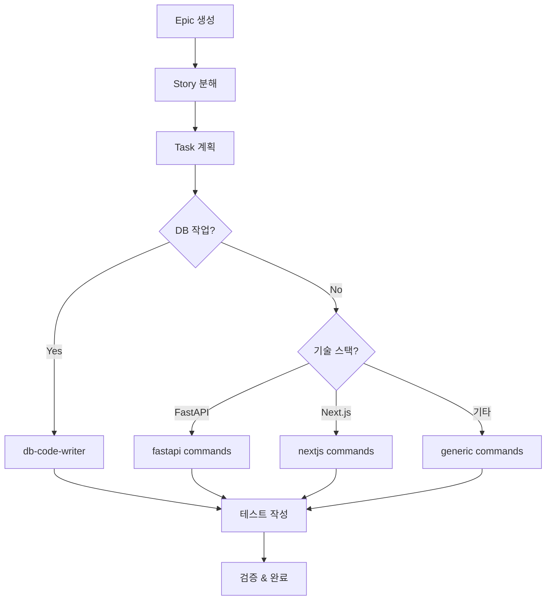

# 🏢 회사 내 Agent 표준 가이드

## 개요

이 문서는 회사 전체에서 사용할 AI Agent 표준을 정의합니다. 모든 프로젝트에서 일관된 Agent 경험과 안전한 개발 워크플로우를 보장하기 위한 가이드라인입니다.

## 🎯 핵심 원칙

### 1. 안전성 우선 (Safety First)
- **데이터 보호**: 파괴적 작업 절대 금지
- **사용자 확인**: 중요 변경사항은 항상 사용자 승인
- **롤백 가능**: 모든 변경은 되돌릴 수 있어야 함

### 2. 범용성과 전문성의 균형
- **범용 Agent**: 모든 프로젝트에서 재사용 가능
- **기술별 전문성**: 스택 감지 시 전문 Commands 활용
- **점진적 확장**: 새 기술 스택 쉽게 추가

### 3. 일관된 경험
- **표준화된 워크플로우**: Epic → Story → Task 체계
- **통일된 메모리 패턴**: Serena MCP 활용
- **동일한 Command 구조**: 예측 가능한 인터페이스

## 🏗️ Agent 아키텍처 표준

### 디렉토리 구조
```
.claude/
├── agents/
│   ├── 01-pre-analysis/     # 사전 분석 Agent들
│   ├── 02-requirements/     # 요구사항 분석
│   ├── 03-design/          # 설계 Agent들  
│   ├── 04-implementation/  # 구현 Agent들
│   ├── 05-post-implementation/ # 후처리 Agent들
│   └── 99-utils/           # 유틸리티 Agent들
├── commands/
│   ├── generic/            # 범용 Commands
│   └── tech-specific/      # 기술별 Commands
│       ├── fastapi/
│       ├── nextjs/
│       ├── sqlalchemy/
│       └── prisma/
└── guides/                 # 가이드라인 문서들
    ├── DB_SAFETY_GUIDELINES.md
    └── COMPANY_AGENT_STANDARDS.md
```

### Agent 명명 규칙
```yaml
형식: "{단계번호}-{카테고리}/{agent-이름}"
예시:
  - 01-pre-analysis/tech-stack-analyzer
  - 04-implementation/code-writer
  - 04-implementation/db-code-writer
```

## 🔧 Commands 표준

### 범용 Commands (필수)
모든 구현 Agent가 가져야 할 기본 Commands:

```yaml
필수 Commands:
  - analyze-task.md      # Task 요구사항 분석
  - update-task.md       # Task 체크박스 업데이트
  - validate.md          # 코드 검증 (컴파일/린트)
  - checkpoint.md        # 진행상황 저장
  - handoff.md          # 다음 Agent로 전달

선택적 Commands:
  - rollback.md         # 변경사항 롤백
  - optimize.md         # 성능 최적화
```

### 기술별 Commands 구조
```yaml
기술 감지 조건:
  fastapi:
    - files: ["pyproject.toml"]
    - patterns: ["fastapi", "uvicorn"]
    - commands: ["implement-api.md", "create-middleware.md"]
  
  nextjs:
    - files: ["package.json"]  
    - patterns: ["next", "@next", "react"]
    - commands: ["implement-component.md", "create-page.md"]
    
  sqlalchemy:
    - files: ["alembic.ini", "migrations/"]
    - patterns: ["sqlalchemy", "alembic"]
    - delegation: "db-code-writer"  # 전용 Agent 위임
```

### Command 파일 표준
```yaml
# Command 파일 헤더 (필수)
---
allowed-tools: [Read, Write, Edit, ...]
argument-hint: [arg1] [arg2-optional]
description: "간단한 설명"
trigger_conditions: ["keyword1", "keyword2"]  # 선택적
tech_requirements: ["file1", "pattern1"]      # 선택적
---
```

## 🛡️ 안전성 표준

### DB 작업 규칙
```yaml
절대 금지:
  - DROP TABLE/DATABASE
  - TRUNCATE  
  - DELETE without WHERE
  - CASCADE 옵션
  - 스키마 직접 변경

허용된 작업:
  - SELECT 쿼리 (조회)
  - 마이그레이션 파일 생성
  - ORM 모델 정의
  - 테스트 데이터 (테스트 DB만)

필수 절차:
  - db-code-writer agent 전용 위임
  - 사용자 수동 마이그레이션 실행
  - 롤백 계획 필수 제공
```

### Agent 간 Delegation 규칙
```bash
# 자동 Delegation 트리거
DB_KEYWORDS=("model" "migration" "database" "table" "schema")
API_KEYWORDS=("endpoint" "router" "api" "fastapi")
UI_KEYWORDS=("component" "page" "hook" "nextjs")

# Delegation 우선순위
1. DB 작업 → db-code-writer (최우선)
2. 기술별 전문 작업 → tech-specific commands
3. 범용 작업 → generic commands
```

## 📊 메모리 패턴 표준

### 네이밍 컨벤션
```yaml
입력 메모리 (읽기):
  - "epic_{epic_id}_overview"        # Epic 개요
  - "story_{story_id}_spec"          # Story 상세
  - "task_{task_id}_context"         # Task 컨텍스트
  - "{tech_stack}_patterns"          # 기술별 패턴

출력 메모리 (쓰기):
  - "implementation_{task_id}"       # 구현 결과
  - "checkpoint_{agent}_{task_id}"   # 체크포인트
  - "handoff_{next_agent}_{task_id}" # 다음 Agent 전달
  - "analysis_{domain}_{timestamp}"  # 분석 결과
```

### 메모리 라이프사이클
```yaml
생성: Agent 작업 시작 시
업데이트: 주요 단계 완료 시
정리: Epic 완료 후 7일 (자동)
백업: 중요 메모리는 docs/ 디렉토리에 영구 저장
```

## 🔄 워크플로우 표준

### 표준 개발 플로우


### Task 상태 관리
```yaml
상태 전환:
  PENDING → IN_PROGRESS → COMPLETED
  
체크박스 패턴:
  - [ ] 미완료
  - [🔄] 진행 중
  - [✅] 완료
  
필수 업데이트:
  - 실시간 진행률 표시
  - 타임스탬프 자동 기록
  - 완료 시 자동 상태 변경
```

## 🎨 사용자 경험 표준

### 일관된 메시지 포맷
```yaml
성공 메시지:
  "✅ {작업명} 완료"
  "📁 생성된 파일: {파일목록}"
  "🔄 다음 단계: {다음작업}"

경고 메시지:
  "⚠️ {위험요소} 감지"
  "📋 사용자 확인 필요: {확인사항}"

에러 메시지:
  "❌ {에러내용}"
  "💡 해결방법: {해결책}"
```

### 진행상황 표시
```yaml
진행률 바: [████░░░░░░] 40%
단계 표시: "3/5 단계 완료"
시간 추정: "예상 완료: 15분 후"
```

## 📈 품질 지표

### Agent 성능 메트릭
```yaml
필수 지표:
  - 안전성 점수: 10/10 (DB 안전성)
  - 완료율: >95% (Task 성공률)
  - 재사용률: >80% (다른 프로젝트 적용)
  - 응답 시간: <5분 (평균 작업 시간)

모니터링:
  - 월 1회 Agent Auditor 실행
  - 분기별 표준 가이드 업데이트
  - 반기별 기술 스택 확장 검토
```

## 🔄 표준 확장 절차

### 새 기술 스택 추가
1. **기술 조사**: 프로젝트에서 실제 사용 확인
2. **Command 개발**: tech-specific/{기술명}/ 디렉토리 생성
3. **Agent 통합**: code-writer에 감지 로직 추가
4. **테스트**: 실제 프로젝트에서 검증
5. **문서화**: 가이드라인 업데이트

### 새 Agent 추가
1. **필요성 검토**: 기존 Agent로 해결 불가능한 영역
2. **설계**: Agent 명세서 작성 (.claude/agents/{단계}/{이름}.md)
3. **Commands**: 필수 Commands 구현
4. **통합**: 기존 Agent들과 연동 테스트
5. **검증**: Agent Auditor로 품질 확인

## 📋 체크리스트

### 새 프로젝트 Agent 적용
- [ ] .claude/ 디렉토리 구조 생성
- [ ] 필수 Agent 파일 복사
- [ ] 프로젝트별 기술 스택 확인
- [ ] DB_SAFETY_GUIDELINES.md 적용
- [ ] 첫 번째 Epic으로 워크플로우 테스트

### Agent 개발/수정 시
- [ ] 안전성 규칙 준수 확인
- [ ] 메모리 패턴 표준 준수
- [ ] Commands 구조 표준 준수
- [ ] Agent Auditor 품질 검증
- [ ] 문서 업데이트

### 정기 점검 (월 1회)
- [ ] Agent 성능 메트릭 확인
- [ ] 새로운 기술 스택 니즈 파악
- [ ] 사용자 피드백 수집
- [ ] 표준 가이드라인 개선사항 식별

---

## 📞 지원 및 피드백

### 문제 해결
1. **Agent 오작동**: Agent Auditor 실행 후 문제 진단
2. **새 기술 요청**: 이슈로 등록 후 검토 프로세스 진행
3. **표준 개선**: 정기 검토 회의에서 논의

### 연락처
- **Agent 표준 담당**: Development Team
- **기술 지원**: DevOps Team  
- **문서 업데이트**: Documentation Team

---

_Version: 1.0_  
_Last Updated: 2025-01-05_  
_Next Review: 2025-04-05_