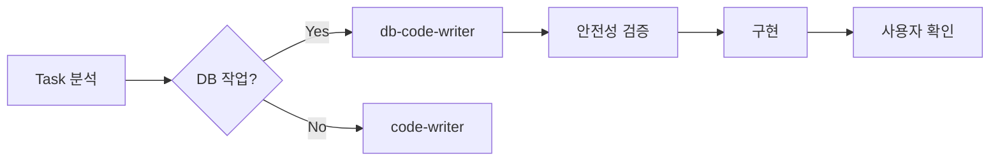

# 🛡️ DB 작업 안전 가이드라인

## 개요
이 문서는 모든 Agent가 준수해야 할 DB 작업 안전 규칙을 정의합니다.
데이터 손실 방지와 안전한 DB 작업을 위한 필수 가이드라인입니다.

## 🚨 핵심 원칙

### 1. Zero Data Loss Policy
- **절대 규칙**: 데이터를 잃을 수 있는 작업은 절대 자동 실행 금지
- **백업 우선**: 중요 변경 전 백업 계획 필수
- **롤백 가능**: 모든 변경은 되돌릴 수 있어야 함

### 2. Agent 책임 분리
```yaml
분석 Agent:
  - comprehensive-db-analyzer: 읽기 전용, DB 구조 분석
  - test-env-analyzer: 테스트 DB 환경 분석

설계 Agent:
  - task-planner: DB 작업을 별도 Task로 분리
  - tech-spec-engineer: DB 설계 명세 작성

구현 Agent:
  - db-code-writer: DB 전문 구현 (신규)
  - code-writer: 일반 코드, DB 작업은 delegation

테스트 Agent:
  - test-creator: DB 테스트 작성
```

## 🔴 절대 금지 작업 (NEVER)

### DDL 파괴적 명령
```sql
-- ❌ 절대 실행 금지
DROP TABLE [table_name];
DROP DATABASE [db_name];
TRUNCATE TABLE [table_name];
ALTER TABLE [table] DROP COLUMN [column];
```

### DML 위험 명령
```sql
-- ❌ WHERE 절 없는 DELETE
DELETE FROM users;  -- 전체 삭제 위험

-- ❌ CASCADE 옵션
DELETE FROM teams CASCADE;  -- 연쇄 삭제
```

### 마이그레이션 자동 실행
```bash
# ❌ 절대 자동 실행 금지
alembic upgrade head  # 사용자가 수동 실행
prisma migrate deploy  # 사용자가 수동 실행
```

## 🟢 허용된 작업 (ALLOWED)

### 안전한 조회
```sql
-- ✅ SELECT는 항상 안전
SELECT * FROM users WHERE id = 1;
SHOW TABLES;
DESCRIBE users;
```

### 마이그레이션 파일 생성
```bash
# ✅ 파일 생성만 허용
alembic revision --autogenerate -m "description"
prisma migrate dev --create-only
```

### 모델 정의
```python
# ✅ ORM 모델 정의
class User(Base):
    __tablename__ = 'users'
    id = Column(Integer, primary_key=True)
```

## 📋 DB 작업 체크리스트

### 작업 전 확인
- [ ] 작업이 db-code-writer agent에게 적합한가?
- [ ] 백업 계획이 있는가?
- [ ] 롤백 계획이 있는가?
- [ ] 데이터 손실 가능성이 있는가?

### 구현 시 확인
- [ ] 파괴적 명령이 포함되지 않았는가?
- [ ] 마이그레이션은 파일 생성만 했는가?
- [ ] 테스트 코드가 작성되었는가?
- [ ] Dry-run으로 검증했는가?

### 완료 후 확인
- [ ] 사용자에게 수동 실행 안내를 했는가?
- [ ] 변경사항이 문서화되었는가?
- [ ] 롤백 방법이 명시되었는가?

## 🔄 Agent Delegation 규칙

### 자동 Delegation 트리거
```python
DB_KEYWORDS = [
    'model', 'migration', 'database', 'table',
    'column', 'index', 'constraint', 'foreign_key',
    'sqlalchemy', 'alembic', 'prisma', 'typeorm'
]

def should_delegate_to_db_agent(task_description):
    for keyword in DB_KEYWORDS:
        if keyword in task_description.lower():
            return True
    return False
```

### Delegation 흐름


## 💡 Best Practices

### 1. 마이그레이션 관리
```bash
# Good: 단계별 실행
alembic revision -m "step1_add_column"
alembic revision -m "step2_migrate_data"
alembic revision -m "step3_add_constraint"

# Bad: 한 번에 모든 변경
alembic revision -m "complete_refactoring"
```

### 2. 트랜잭션 관리
```python
# Good: 명시적 트랜잭션
with session.begin():
    user = User(name="test")
    session.add(user)
    # 자동 커밋 또는 롤백

# Bad: 암묵적 커밋
session.add(user)
session.commit()  # 에러 시 부분 커밋 위험
```

### 3. 쿼리 최적화
```python
# Good: Eager Loading
users = session.query(User).options(joinedload(User.teams)).all()

# Bad: N+1 Problem
users = session.query(User).all()
for user in users:
    print(user.teams)  # N개의 추가 쿼리
```

## 🚧 위험 신호 (Red Flags)

다음 상황을 발견하면 즉시 중단:
- 프로덕션 DB 직접 접근 시도
- 백업 없는 대량 데이터 변경
- 테스트 없는 스키마 변경
- 롤백 불가능한 변경

## 📝 문서화 템플릿

### DB 변경 기록
```markdown
## 변경 일자: YYYY-MM-DD
### 변경 내용
- 테이블: [table_name]
- 작업: [ADD COLUMN/CREATE INDEX/etc]
- 영향: [영향받는 기능]

### 실행 방법
\`\`\`bash
# 사용자가 직접 실행
uv run alembic upgrade head
\`\`\`

### 롤백 방법
\`\`\`bash
uv run alembic downgrade -1
\`\`\`

### 검증 방법
- [ ] 마이그레이션 성공
- [ ] 데이터 무결성 확인
- [ ] 애플리케이션 정상 동작
```

## 🔐 보안 고려사항

### 민감 데이터 처리
- PII 데이터 암호화
- 비밀번호 해싱 (bcrypt/argon2)
- API 키 환경변수 사용

### SQL Injection 방지
```python
# Good: 파라미터 바인딩
session.query(User).filter(User.id == user_id)

# Bad: 문자열 연결
session.execute(f"SELECT * FROM users WHERE id = {user_id}")
```

## 📞 에스컬레이션 정책

### 즉시 사용자 확인 필요
1. DROP/TRUNCATE 명령 요청 시
2. 대량 데이터 변경 필요 시
3. 프로덕션 DB 접근 필요 시
4. 복구 불가능한 변경 시

### 전문가 검토 필요
1. 복잡한 마이그레이션
2. 성능 크리티컬한 인덱스 변경
3. 외래키 제약 조건 변경
4. 파티셔닝 전략 변경

---

_Last Updated: 2025-01-05_
_Version: 1.0_
_Status: Active Policy_